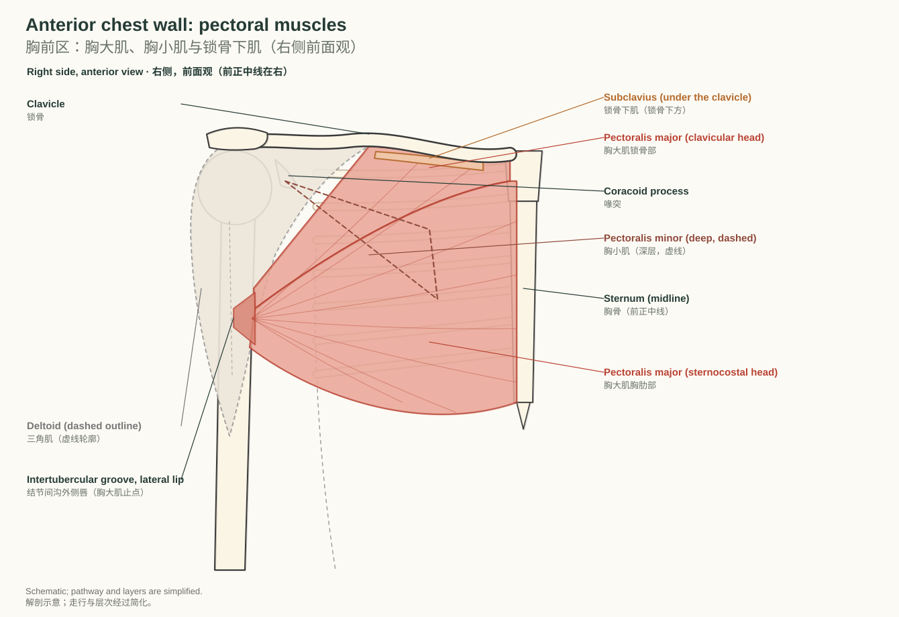
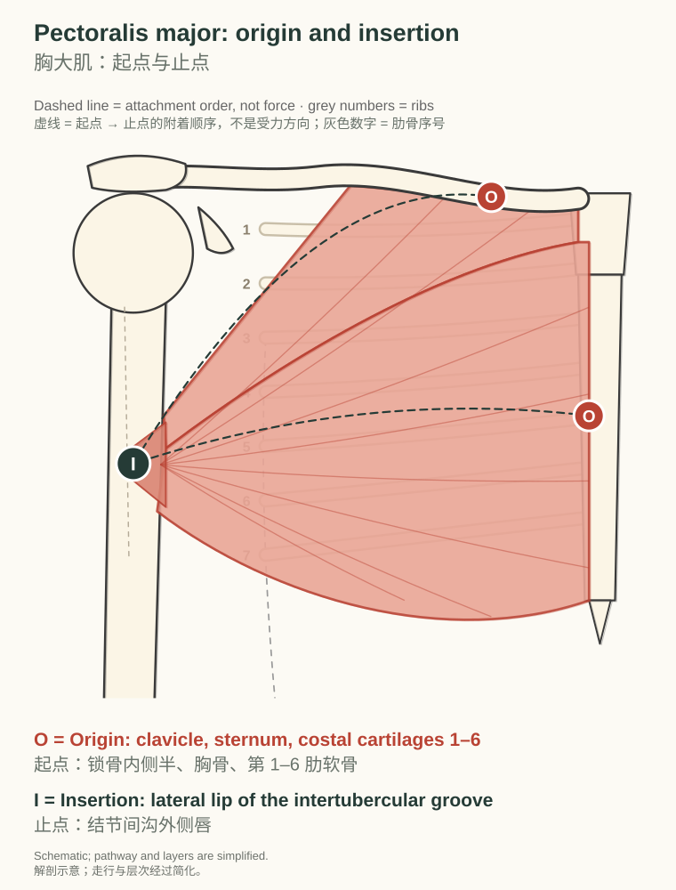
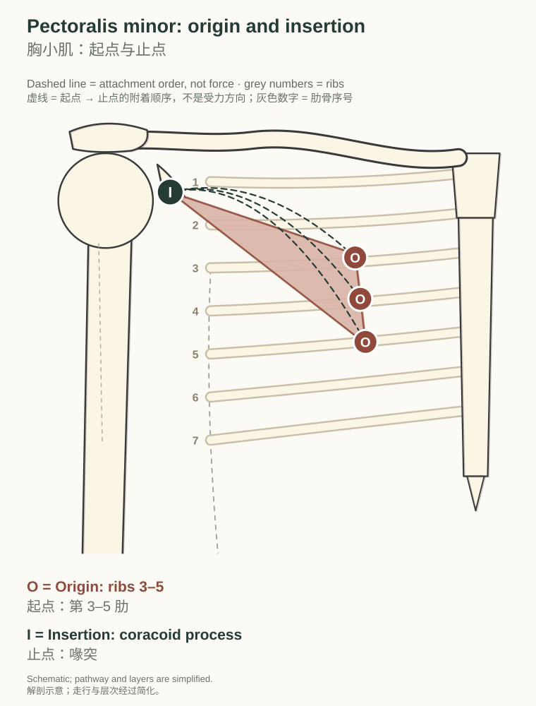
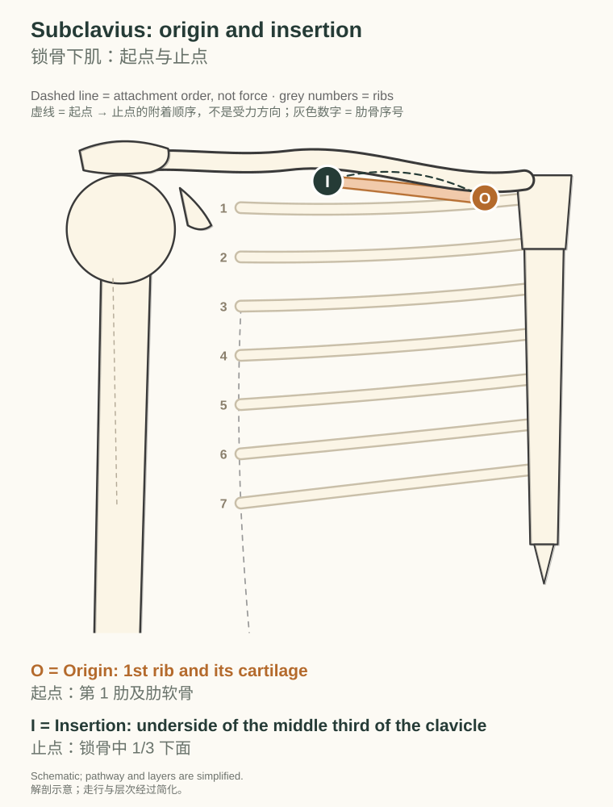
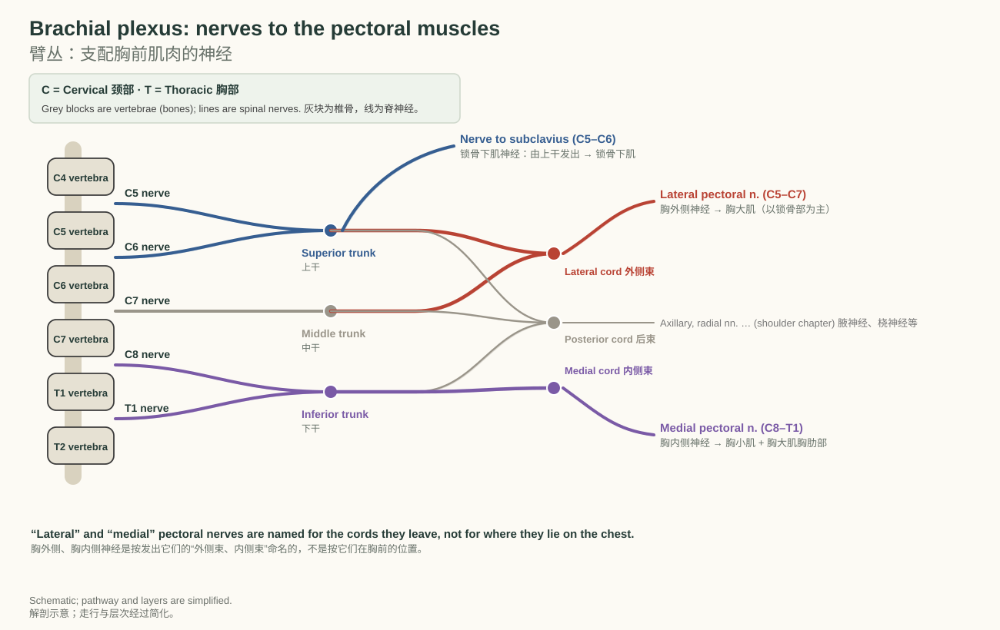
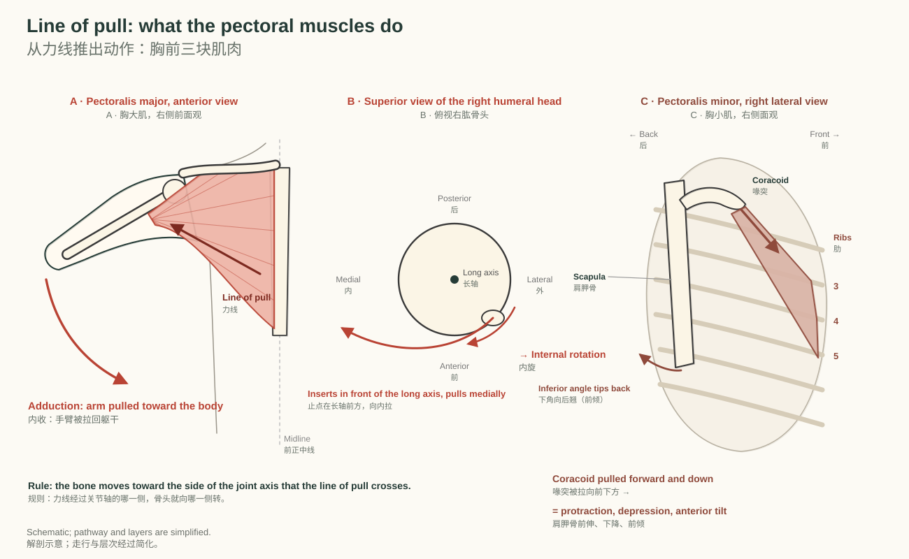
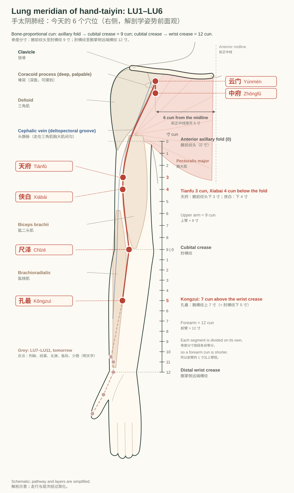
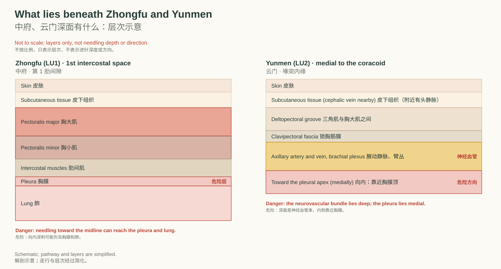

# 第 1 天：肺经与胸前肌

DPT 基础 · 2026-10-07 · 手太阴肺经前 6 穴 + 胸大肌、胸小肌、锁骨下肌

## 01 Muscles: the anterior chest wall

今日肌肉：胸前区

> **After this chapter you can｜读完本章，你能够**
> 1. Name the three anterior chest wall muscles in English and Chinese. 用英文和中文说出胸前区的三块肌肉。
> 2. State each muscle's origin and insertion and point to them on your own chest. 说出每块肌肉的起点和止点，并在自己胸前指出来。
> 3. Tell which of the three lies deepest. 说出三块肌肉里哪一块最深。
>
> **Key terms｜关键词：** Pectoralis major（胸大肌） `pek-tuh-RAY-lis MAY-jer` /ˌpɛktəˈreɪlɪs ˈmeɪdʒər/ · Pectoralis minor（胸小肌） `pek-tuh-RAY-lis MY-ner` /ˌpɛktəˈreɪlɪs ˈmaɪnər/ · Subclavius（锁骨下肌） `sub-KLAY-vee-uhs` /sʌbˈkleɪviəs/ · [Clavicle](http://127.0.0.1:5178/?term=clavicle)（锁骨） `KLAV-ih-kuhl` /ˈklævɪkəl/ · Sternum（胸骨） `STUR-nuhm` /ˈstɝnəm/ · Coracoid process（喙突） `KOR-uh-koyd PRAH-ses` /ˈkɔrəˌkɔɪd ˈprɑsɛs/ · Costal cartilage（肋软骨） `KOS-tuhl KAR-tuh-lij` /ˈkɑstəl ˈkɑrtəlɪdʒ/ · [Intertubercular groove](http://127.0.0.1:5178/?term=intertubercular-groove)（结节间沟） `in-ter-too-BUR-kyuh-ler GROOV` /ˌɪntərtuˈbɝkjələr ɡruv/

Three muscles cover the front of the upper chest. The pectoralis major is the large superficial fan; the pectoralis minor lies beneath it; the subclavius is a small muscle hidden under the [clavicle](http://127.0.0.1:5178/?term=clavicle).

胸前上部有三块肌肉：胸大肌是最浅、最大的一片扇形肌；胸小肌在它的深面；锁骨下肌是一块藏在锁骨下方的小肌肉。

*Right side, anterior view. Pectoralis major is shown in red; pectoralis minor (deep) is dashed; the subclavius lies under the [clavicle](http://127.0.0.1:5178/?term=clavicle).*  
*右侧前面观。胸大肌为红色；胸小肌在深层，用虚线表示；锁骨下肌位于锁骨下方。*

### Origins, insertions, and course｜起点、止点与走行

O = origin; I = insertion. The dashed O → I line shows the attachment order only; force and movement are drawn with solid arrows in Chapter 03.

O 表示起点，I 表示止点。虚线 O → I 只表示附着顺序；受力和动作在第 03 章用实线箭头表示。

#### Pectoralis major｜胸大肌

- **Origin 起点**：Clavicular head: medial half of the [clavicle](http://127.0.0.1:5178/?term=clavicle). Sternocostal head: sternum, upper six costal cartilages, and the aponeurosis of the external oblique｜锁骨部：锁骨内侧半；胸肋部：胸骨、上 6 个肋软骨及腹外斜肌腱膜
- **Insertion 止点**：Lateral lip of the [intertubercular groove](http://127.0.0.1:5178/?term=intertubercular-groove) of the [humerus](http://127.0.0.1:5178/?term=humerus)｜肱骨结节间沟外侧唇
- **Nerve 神经**：Lateral pectoral nerve (C5–C7) and medial pectoral nerve (C8–T1)｜胸外侧神经（C5–C7）和胸内侧神经（C8–T1）
- **Action 动作**：Adducts and internally rotates the [humerus](http://127.0.0.1:5178/?term=humerus); the clavicular part also flexes the shoulder｜使肱骨内收、内旋；锁骨部还使肩前屈

The pectoralis major originates from the [clavicle](http://127.0.0.1:5178/?term=clavicle), sternum, and upper costal cartilages, passes laterally across the front of the chest, and inserts onto the lateral lip of the [intertubercular groove](http://127.0.0.1:5178/?term=intertubercular-groove).

胸大肌起自锁骨、胸骨和上部肋软骨，向外侧横过胸前，止于肱骨结节间沟外侧唇。

穴位锚点：中府（浅层）、云门（外缘）

#### Pectoralis minor｜胸小肌

- **Origin 起点**：Outer surfaces of ribs 3–5 near their costal cartilages｜第 3–5 肋外面，靠近肋软骨处
- **Insertion 止点**：Coracoid process of the [scapula](http://127.0.0.1:5178/?term=scapula)｜肩胛骨喙突
- **Nerve 神经**：Medial pectoral nerve (C8–T1)｜胸内侧神经（C8–T1）
- **Action 动作**：Protracts and depresses the [scapula](http://127.0.0.1:5178/?term=scapula) and tilts it forward; lifts the ribs when the [scapula](http://127.0.0.1:5178/?term=scapula) is fixed｜使肩胛骨前伸、下降并前倾；肩胛骨固定时上提肋骨

The pectoralis minor originates from ribs 3 to 5, passes upward and laterally beneath the pectoralis major, and inserts onto the coracoid process.

胸小肌起自第 3–5 肋，在胸大肌深面向外上方走行，止于喙突。

穴位锚点：中府（深层）

#### Subclavius｜锁骨下肌

- **Origin 起点**：Junction of the first rib and its costal cartilage｜第 1 肋与肋软骨交界处
- **Insertion 止点**：Inferior surface of the middle third of the [clavicle](http://127.0.0.1:5178/?term=clavicle)｜锁骨中 1/3 下面
- **Nerve 神经**：Nerve to subclavius (C5–C6)｜锁骨下肌神经（C5–C6）
- **Action 动作**：Anchors and depresses the [clavicle](http://127.0.0.1:5178/?term=clavicle); steadies the sternoclavicular joint｜固定并下拉锁骨；稳定胸锁关节

The subclavius originates from the first rib, passes laterally beneath the [clavicle](http://127.0.0.1:5178/?term=clavicle), and inserts onto the inferior surface of its middle third.

锁骨下肌起自第 1 肋，在锁骨下方向外侧走行，止于锁骨中 1/3 的下面。

穴位锚点：云门附近（锁骨下窝）

#### How to remember them｜三步记住这三块肌肉

1. **Feel 摸**：Lay your left hand flat on your right chest and squeeze your arm against your side: the muscle that hardens under your palm is the pectoralis major. Then press into the hollow below the outer [clavicle](http://127.0.0.1:5178/?term=clavicle); the hard knob deep there is the coracoid process, where the pectoralis minor hangs. 左手平放在右胸，右臂往身体侧夹紧：手掌下变硬的就是胸大肌。再按锁骨外侧下方的凹陷，深处硬硬的骨突是喙突，胸小肌就挂在它上面。
2. **Draw 画**：Close the page and draw three strokes: a big fan from the [clavicle](http://127.0.0.1:5178/?term=clavicle) and sternum to the arm, a small triangle from ribs 3–5 up to the coracoid, and a short bar under the [clavicle](http://127.0.0.1:5178/?term=clavicle). Then compare with Figure 01. 合上页面画三笔：从锁骨和胸骨扇向手臂的大扇子；从第 3–5 肋收到喙突的小三角；锁骨下面一根短横条。画完对照图 01。
3. **Move 动**：Act each one out: hug a tree (pectoralis major: adduction and internal rotation); roll your shoulder forward and down (pectoralis minor); hold your [clavicle](http://127.0.0.1:5178/?term=clavicle) down toward the first rib (subclavius). 用动作记：抱大树（胸大肌：内收、内旋）；肩膀向前下方扣（胸小肌）；把锁骨压向第 1 肋（锁骨下肌）。

**Number hook 数字钩子**：major 1–6 · minor 3–5 · subclavius 1（胸大肌连第 1–6 肋软骨，胸小肌第 3–5 肋，锁骨下肌第 1 肋）

#### Check yourself｜先自测

**Q.** Which of the three muscles attaches to the coracoid process? 三块肌肉里，哪一块附着在喙突上？

Answer 答案

The pectoralis minor. It runs from ribs 3 to 5 up to the coracoid process. 胸小肌。它从第 3–5 肋向上止于喙突。

**Q.** Where does the pectoralis major insert, and which tendon lies just medial to that insertion? 胸大肌止于哪里？紧挨着止点内侧的是哪条肌腱？

Answer 答案

On the lateral lip of the [intertubercular groove](http://127.0.0.1:5178/?term=intertubercular-groove); the long head of biceps runs in the groove just medial to it. 止于结节间沟外侧唇；肱二头肌长头腱就在它内侧的沟里走行。

> **Take-home 本章要点：** Pectoralis major is the superficial fan to the [humerus](http://127.0.0.1:5178/?term=humerus); pectoralis minor runs deep to it from ribs 3–5 to the coracoid; subclavius sits under the [clavicle](http://127.0.0.1:5178/?term=clavicle).  
> 胸大肌是最浅的扇形肌，止于肱骨；胸小肌在它深面，从第 3–5 肋到喙突；锁骨下肌藏在锁骨下方。

## 02 Innervation: the pectoral nerves

神经支配：胸前肌肉的神经

> **After this chapter you can｜读完本章，你能够**
> 1. Name the nerve to each of today's three muscles. 说出今天三块肌肉各自的支配神经。
> 2. Trace each nerve back to its cord or trunk and its spinal segments. 把每条神经追溯到它来自的束或干，以及对应的脊神经节段。
>
> **Key terms｜关键词：** Brachial plexus（臂丛） `BRAY-kee-uhl PLEK-suhs` /ˈbreɪkiəl ˈplɛksəs/ · Lateral pectoral nerve（胸外侧神经） `LAT-er-uhl PEK-tuh-ruhl NURV` /ˈlætərəl ˈpɛktərəl nɝv/ · Medial pectoral nerve（胸内侧神经） `MEE-dee-uhl PEK-tuh-ruhl NURV` /ˈmidiəl ˈpɛktərəl nɝv/ · Nerve to subclavius（锁骨下肌神经） `NURV tuh sub-KLAY-vee-uhs` /nɝv tə sʌbˈkleɪviəs/ · Lateral cord（外侧束） `LAT-er-uhl KORD` /ˈlætərəl kɔrd/ · Medial cord（内侧束） `MEE-dee-uhl KORD` /ˈmidiəl kɔrd/ · Superior trunk（上干） `suh-PEER-ee-er TRUNGK` /səˈpɪriər trʌŋk/

> **C = Cervical · 颈部   T = Thoracic · 胸部** — C5–C7 第 5–7 颈神经，经外侧束 → 胸外侧神经；C8–T1 第 8 颈神经与第 1 胸神经，经内侧束 → 胸内侧神经；C5–C6 上干直接发出 → 锁骨下肌神经

*Brachial plexus overview. Red: lateral cord to the lateral pectoral nerve. Purple: medial cord to the medial pectoral nerve. Blue: superior trunk to the nerve to subclavius.*  
*臂丛总览。红色：外侧束 → 胸外侧神经；紫色：内侧束 → 胸内侧神经；蓝色：上干 → 锁骨下肌神经。*

The lateral pectoral nerve (C5–C7) leaves the lateral cord and mainly supplies the clavicular part of the pectoralis major. The medial pectoral nerve (C8–T1) leaves the medial cord, pierces the pectoralis minor, and supplies both the pectoralis minor and the sternocostal part of the pectoralis major.

胸外侧神经（C5–C7）由外侧束发出，主要支配胸大肌锁骨部。胸内侧神经（C8–T1）由内侧束发出，穿过胸小肌，支配胸小肌和胸大肌胸肋部。

The nerve to subclavius (C5–C6) is a small branch of the superior trunk. Because the two pectoral nerves come from different cords, the pectoralis major receives fibres from C5 all the way to T1.

锁骨下肌神经（C5–C6）是上干发出的一条小分支。两条胸神经来自不同的束，所以胸大肌接受从 C5 一直到 T1 的纤维。

**易混点：** “外侧”“内侧”是按发出的束命名的。胸内侧神经在胸前反而走得更靠外，穿过胸小肌。

#### Check yourself｜先自测

**Q.** Which nerve pierces the pectoralis minor? 哪条神经穿过胸小肌？

Answer 答案

The medial pectoral nerve (C8–T1). 胸内侧神经（C8–T1）。

**Q.** Why does the pectoralis major carry fibres from C5 to T1? 为什么胸大肌的神经纤维从 C5 一直到 T1？

Answer 答案

It is supplied by both the lateral pectoral nerve (C5–C7, lateral cord) and the medial pectoral nerve (C8–T1, medial cord). 因为它同时由胸外侧神经（C5–C7，外侧束）和胸内侧神经（C8–T1，内侧束）支配。

> **Take-home 本章要点：** Lateral pectoral = lateral cord, C5–C7; medial pectoral = medial cord, C8–T1, through pectoralis minor; nerve to subclavius = superior trunk, C5–C6.  
> 胸外侧神经来自外侧束（C5–C7）；胸内侧神经来自内侧束（C8–T1），穿过胸小肌；锁骨下肌神经来自上干（C5–C6）。

## 03 Movement: from attachment to action

动作：从附着到动作

> **After this chapter you can｜读完本章，你能够**
> 1. Predict the actions of pectoralis major from its line of pull. 根据力线推出胸大肌的动作。
> 2. Explain how pectoralis minor moves the [scapula](http://127.0.0.1:5178/?term=scapula). 解释胸小肌怎样带动肩胛骨。
>
> **Key terms｜关键词：** Adduction（内收） `uh-DUK-shuhn` /əˈdʌkʃən/ · Internal rotation（内旋） `in-TUR-nuhl roh-TAY-shuhn` /ɪnˈtɝnəl roʊˈteɪʃən/ · Flexion（屈） `FLEK-shuhn` /ˈflɛkʃən/ · Protraction（前伸） `proh-TRAK-shuhn` /proʊˈtrækʃən/ · Depression（下降） `dih-PRESH-uhn` /dɪˈprɛʃən/ · Line of pull（力线） `LYNE uhv PUL` /laɪn əv pʊl/

*A: pectoralis major pulls the arm toward the midline. B: it inserts in front of the humeral long axis, so it rotates the [humerus](http://127.0.0.1:5178/?term=humerus) internally. C: pectoralis minor pulls the [scapula](http://127.0.0.1:5178/?term=scapula) forward and down.*  
*A：胸大肌把手臂拉向中线；B：止点在肱骨长轴前方，所以使肱骨内旋；C：胸小肌把肩胛骨拉向前下方。*

The pectoralis major crosses the front of the shoulder and inserts in front of the long axis of the [humerus](http://127.0.0.1:5178/?term=humerus). It therefore adducts and internally rotates the arm. Its clavicular part, which lies higher, also flexes the shoulder.

胸大肌从肩关节前方跨过，止点在肱骨长轴前方，所以使手臂内收、内旋。位置较高的锁骨部还能使肩前屈。

The pectoralis minor pulls the coracoid process forward and downward, so it protracts and depresses the [scapula](http://127.0.0.1:5178/?term=scapula) and tilts it forward. When the [scapula](http://127.0.0.1:5178/?term=scapula) is fixed, it can lift the ribs and assist deep inspiration.

胸小肌把喙突拉向前下方，使肩胛骨前伸、下降并前倾。肩胛骨固定时，它可以上提肋骨，协助深吸气。

The subclavius pulls the [clavicle](http://127.0.0.1:5178/?term=clavicle) toward the first rib and steadies the sternoclavicular joint during arm movement.

锁骨下肌把锁骨拉向第 1 肋，在手臂活动时稳定胸锁关节。

#### Check yourself｜先自测

**Q.** A muscle inserts in front of the humeral long axis and pulls medially. Which rotation does it produce? 一块肌肉止于肱骨长轴前方，并向内牵拉。它产生哪种旋转？

Answer 答案

Internal rotation, as with the pectoralis major. 内旋，胸大肌就是这样。

**Q.** Which of today's muscles moves the [scapula](http://127.0.0.1:5178/?term=scapula) rather than the [humerus](http://127.0.0.1:5178/?term=humerus)? 今天的肌肉里，哪一块带动的是肩胛骨而不是肱骨？

Answer 答案

The pectoralis minor; it attaches to the coracoid process of the [scapula](http://127.0.0.1:5178/?term=scapula). 胸小肌；它止于肩胛骨的喙突。

> **Take-home 本章要点：** Pectoralis major: adduction and internal rotation (clavicular part also flexes). Pectoralis minor: [scapula](http://127.0.0.1:5178/?term=scapula) forward and down. Subclavius: steadies the [clavicle](http://127.0.0.1:5178/?term=clavicle).  
> 胸大肌：内收、内旋（锁骨部还能前屈）。胸小肌：把肩胛骨拉向前下方。锁骨下肌：稳定锁骨。

## 04 Acupoints: lung meridian LU1–LU6

穴位：手太阴肺经前 6 穴

> **After this chapter you can｜读完本章，你能够**
> 1. Locate Zhongfu, Yunmen, Tianfu, Xiabai, Chize, and Kongzui on your own body. 在自己身上找到中府、云门、天府、侠白、尺泽、孔最。
> 2. Use bone-proportional cun to place Tianfu, Xiabai, and Kongzui. 用骨度分寸定位天府、侠白、孔最。
> 3. State what lies deep to Zhongfu and Yunmen. 说出中府、云门深面有什么。
>
> **Key terms｜关键词：** 中府（Zhōngfǔ） · 云门（Yúnmén） · 天府（Tiānfǔ） · 侠白（Xiábái） · 尺泽（Chǐzé） · 孔最（Kǒngzuì）

The lung meridian starts on the chest at Zhongfu, runs along the anterolateral (radial) side of the upper limb, passes the radial side of the cubital crease at Chize, and ends at the thumb. Today covers the first six points, from the chest to the upper forearm.

手太阴肺经在体表从胸前的中府出发，沿上肢内侧前缘（桡侧）下行，经肘横纹桡侧的尺泽，止于拇指。今天学前 6 个，从胸前走到前臂上段。

*Right side, anatomical position. Red dots are today's six points; grey dots are tomorrow's. The ruler shows the bone-proportional cun.*  
*右侧，解剖学姿势前面观。红点是今天的 6 个穴位，灰点明天学；左侧标尺是骨度分寸。*

#### 中府（Zhōngfǔ）

- 定位：在胸部，横平第 1 肋间隙，锁骨下窝外侧，前正中线旁开 6 寸
- 层次：皮肤 → 皮下组织 → 胸大肌 → 胸小肌
- 安全：深面为胸腔和肺：向外斜刺，不可向内深刺
- 相关肌肉：胸大肌、胸小肌
- 怎么找：先找云门，向下 1 寸，平第 1 肋间隙

#### 云门（Yúnmén）

- 定位：在胸部，锁骨下窝凹陷中，肩胛骨喙突内缘，前正中线旁开 6 寸
- 层次：皮肤 → 皮下组织 → 三角肌与胸大肌之间 → 锁胸筋膜
- 安全：深面有腋动脉、腋静脉和臂丛，内侧靠近胸膜：向外斜刺，不可向内深刺
- 相关肌肉：胸大肌、三角肌（两肌之间）
- 怎么找：手臂稍向前抬，锁骨外端下方出现凹陷；摸到喙突，贴着它内缘的凹陷就是

#### 天府（Tiānfǔ）

- 定位：在臂前区，腋前纹头下 3 寸，肱二头肌桡侧缘处
- 层次：皮肤 → 皮下组织 → 肱二头肌桡侧缘 → 肱肌
- 安全：附近有头静脉，进针时避开
- 相关肌肉：肱二头肌、肱肌
- 怎么找：腋前纹头到肘横纹为 9 寸，取上 1/3 处，在肱二头肌外侧缘

#### 侠白（Xiábái）

- 定位：在臂前区，腋前纹头下 4 寸，肱二头肌桡侧缘处
- 层次：皮肤 → 皮下组织 → 肱二头肌桡侧缘 → 肱肌
- 安全：附近有头静脉，进针时避开
- 相关肌肉：肱二头肌、肱肌
- 怎么找：天府下 1 寸；“侠”同“夹”，夹着肱二头肌

#### 尺泽（Chǐzé）

- 定位：在肘区，肘横纹上，肱二头肌腱桡侧缘凹陷中
- 层次：皮肤 → 皮下组织 → 肱桡肌 → 肱肌
- 安全：深面在肱桡肌与肱肌之间有桡神经
- 相关肌肉：肱桡肌、肱肌
- 怎么找：微屈肘，摸到绷紧的肱二头肌腱，腱的桡侧（拇指侧）凹陷

#### 孔最（Kǒngzuì）

- 定位：在前臂前区，腕掌侧远端横纹上 7 寸，尺泽与太渊连线上
- 层次：皮肤 → 皮下组织 → 肱桡肌 → 桡侧腕屈肌 → 旋前圆肌 → 拇长屈肌
- 安全：浅层有头静脉；深层有桡动脉和桡神经浅支，避开血管
- 相关肌肉：肱桡肌、旋前圆肌、拇长屈肌
- 怎么找：肘横纹到腕横纹为 12 寸；从尺泽向下 5 寸，在尺泽与太渊的连线上

### What lies beneath Zhongfu and Yunmen｜中府、云门深面有什么

*Layers from skin to deep structures. Not to scale and not a needling depth.*  
*从皮肤到深层结构的层次；不按比例，不表示进针深度。*

Both points lie over the upper chest wall. Deep to Zhongfu are the pectoral muscles, the first intercostal space, the pleura, and the lung. Deep to Yunmen, beneath the clavipectoral fascia, run the axillary artery and vein and the cords of the brachial plexus.

两个穴位都在上胸壁。中府深面依次是胸大肌、胸小肌、第 1 肋间隙、胸膜和肺；云门深面、锁胸筋膜之下，有腋动脉、腋静脉和臂丛的各束。

#### Check yourself｜先自测

**Q.** How many cun below the anterior axillary fold is Tianfu, and how many is Xiabai? 天府在腋前纹头下几寸？侠白呢？

Answer 答案

Tianfu is 3 cun below the fold and Xiabai 4 cun, both on the radial border of the biceps. 天府在下 3 寸，侠白在下 4 寸，都在肱二头肌桡侧缘。

**Q.** Which nerve lies deep to Chize? 尺泽深面有哪条神经？

Answer 答案

The radial nerve, between the brachioradialis and the brachialis. 桡神经，位于肱桡肌与肱肌之间。

> **Take-home 本章要点：** Zhongfu and Yunmen sit over the pectoral muscles with pleura and the axillary bundle deep; Tianfu and Xiabai follow the biceps; Chize is at the biceps tendon; Kongzui is 7 cun above the wrist.  
> 中府、云门压在胸前肌肉上，深面是胸膜和腋部神经血管束；天府、侠白沿着肱二头肌；尺泽在肱二头肌腱旁；孔最在腕横纹上 7 寸。

## 05 Review and recall

整理与复习

> **After this chapter you can｜读完本章，你能够**
> 1. Recall all six points and three muscles without looking. 不看页面，说出今天的 6 个穴位和 3 块肌肉。
>
> **Key terms｜关键词：** Origin（起点） `OR-uh-juhn` /ˈɔrədʒən/ · Insertion（止点） `in-SUR-shuhn` /ɪnˈsɝʃən/ · Innervation（神经支配） `in-er-VAY-shuhn` /ˌɪnərˈveɪʃən/

### 5.1 One-page summary｜5.1 一页总结

| Muscle 肌肉 | Origin 起点 | Insertion 止点 | Nerve 神经 | Action 动作 | Acupoint 穴位锚点 |
|---|---|---|---|---|---|
| Pectoralis major 胸大肌 | [Clavicle](http://127.0.0.1:5178/?term=clavicle), sternum, costal cartilages 1–6 锁骨内侧半、胸骨、第 1–6 肋软骨 | Lateral lip, [intertubercular groove](http://127.0.0.1:5178/?term=intertubercular-groove) 结节间沟外侧唇 | Lateral + medial pectoral nn. (C5–T1) 胸外侧、胸内侧神经 | Adduction, internal rotation; flexion (clavicular part) 内收、内旋；锁骨部前屈 | Zhongfu (superficial layer), Yunmen (lateral edge) 中府（浅层）、云门（外缘） |
| Pectoralis minor 胸小肌 | Ribs 3–5 第 3–5 肋 | Coracoid process 喙突 | Medial pectoral n. (C8–T1) 胸内侧神经 | [Scapula](http://127.0.0.1:5178/?term=scapula) forward and down 肩胛骨前伸、下降 | Zhongfu (deep layer) 中府（深层） |
| Subclavius 锁骨下肌 | 1st rib and cartilage 第 1 肋及肋软骨 | Underside of [clavicle](http://127.0.0.1:5178/?term=clavicle), middle third 锁骨中 1/3 下面 | Nerve to subclavius (C5–C6) 锁骨下肌神经 | Steadies the [clavicle](http://127.0.0.1:5178/?term=clavicle) 稳定锁骨 | near Yunmen (infraclavicular fossa) 云门附近（锁骨下窝） |

| Point 穴位 | Location 定位 | Layers 层次 | Safety 安全 |
|---|---|---|---|
| Zhōngfǔ 中府 | 1st intercostal space, 6 cun lateral to the midline 在胸部，横平第 1 肋间隙，锁骨下窝外侧，前正中线旁开 6 寸 |  皮肤 → 皮下组织 → 胸大肌 → 胸小肌 |  深面为胸腔和肺：向外斜刺，不可向内深刺 |
| Yúnmén 云门 | Infraclavicular fossa, medial to the coracoid, 6 cun lateral 在胸部，锁骨下窝凹陷中，肩胛骨喙突内缘，前正中线旁开 6 寸 |  皮肤 → 皮下组织 → 三角肌与胸大肌之间 → 锁胸筋膜 |  深面有腋动脉、腋静脉和臂丛，内侧靠近胸膜：向外斜刺，不可向内深刺 |
| Tiānfǔ 天府 | 3 cun below the anterior axillary fold, radial border of biceps 在臂前区，腋前纹头下 3 寸，肱二头肌桡侧缘处 |  皮肤 → 皮下组织 → 肱二头肌桡侧缘 → 肱肌 |  附近有头静脉，进针时避开 |
| Xiábái 侠白 | 4 cun below the anterior axillary fold, radial border of biceps 在臂前区，腋前纹头下 4 寸，肱二头肌桡侧缘处 |  皮肤 → 皮下组织 → 肱二头肌桡侧缘 → 肱肌 |  附近有头静脉，进针时避开 |
| Chǐzé 尺泽 | On the cubital crease, radial to the biceps tendon 在肘区，肘横纹上，肱二头肌腱桡侧缘凹陷中 |  皮肤 → 皮下组织 → 肱桡肌 → 肱肌 |  深面在肱桡肌与肱肌之间有桡神经 |
| Kǒngzuì 孔最 | 7 cun above the wrist crease on the Chize–Taiyuan line 在前臂前区，腕掌侧远端横纹上 7 寸，尺泽与太渊连线上 |  皮肤 → 皮下组织 → 肱桡肌 → 桡侧腕屈肌 → 旋前圆肌 → 拇长屈肌 |  浅层有头静脉；深层有桡动脉和桡神经浅支，避开血管 |

### 5.2 The lung meridian song｜5.2 肺经穴歌

**经穴歌（传统）：** 手太阴肺十一穴，中府云门天府诀，侠白尺泽孔最存，列缺经渠太渊涉，鱼际少商如韭叶。

The song lists all eleven lung meridian points in order. Today you have learned the first six, up to Kongzui.

这首歌按顺序列出肺经全部 11 个穴位。今天学到第 6 个，孔最。

### 5.3 Pronunciation list｜5.3 读音表

Capital letters mark the stressed syllable. Press the speaker to hear it, say it twice, then open the dictionary link to check a recorded voice.

大写（页面里加粗）的音节是重音。先点喇叭听，跟读两遍；想听真人录音就点词典链接。

| Term 术语 | Stress 重音 | IPA | Dictionary |
|---|---|---|---|
| Pectoralis major 胸大肌 | pek-tuh-RAY-lis MAY-jer | /ˌpɛktəˈreɪlɪs ˈmeɪdʒər/ | [link](https://www.merriam-webster.com/medical/pectoralis) |
| Pectoralis minor 胸小肌 | pek-tuh-RAY-lis MY-ner | /ˌpɛktəˈreɪlɪs ˈmaɪnər/ | [link](https://www.merriam-webster.com/medical/pectoralis) |
| Subclavius 锁骨下肌 | sub-KLAY-vee-uhs | /sʌbˈkleɪviəs/ | [link](https://www.merriam-webster.com/medical/subclavius) |
| [Clavicle](http://127.0.0.1:5178/?term=clavicle) 锁骨 | KLAV-ih-kuhl | /ˈklævɪkəl/ | [link](https://www.merriam-webster.com/dictionary/clavicle) |
| Sternum 胸骨 | STUR-nuhm | /ˈstɝnəm/ | [link](https://www.merriam-webster.com/dictionary/sternum) |
| Coracoid process 喙突 | KOR-uh-koyd PRAH-ses | /ˈkɔrəˌkɔɪd ˈprɑsɛs/ | [link](https://www.merriam-webster.com/dictionary/coracoid) |
| Costal cartilage 肋软骨 | KOS-tuhl KAR-tuh-lij | /ˈkɑstəl ˈkɑrtəlɪdʒ/ | [link](https://www.merriam-webster.com/dictionary/costal) |
| [Intertubercular groove](http://127.0.0.1:5178/?term=intertubercular-groove) 结节间沟 | in-ter-too-BUR-kyuh-ler GROOV | /ˌɪntərtuˈbɝkjələr ɡruv/ | [link](https://www.merriam-webster.com/dictionary/tubercular) |
| Lateral pectoral nerve 胸外侧神经 | LAT-er-uhl PEK-tuh-ruhl NURV | /ˈlætərəl ˈpɛktərəl nɝv/ | [link](https://www.merriam-webster.com/dictionary/pectoral) |
| Medial pectoral nerve 胸内侧神经 | MEE-dee-uhl PEK-tuh-ruhl NURV | /ˈmidiəl ˈpɛktərəl nɝv/ | [link](https://www.merriam-webster.com/dictionary/medial) |
| Brachial plexus 臂丛 | BRAY-kee-uhl PLEK-suhs | /ˈbreɪkiəl ˈplɛksəs/ | [link](https://www.merriam-webster.com/medical/brachial%20plexus) |
| Adduction 内收 | uh-DUK-shuhn | /əˈdʌkʃən/ | [link](https://www.merriam-webster.com/dictionary/adduction) |
| Protraction 前伸 | proh-TRAK-shuhn | /proʊˈtrækʃən/ | [link](https://www.merriam-webster.com/dictionary/protraction) |
| Biceps brachii 肱二头肌 | BY-seps BRAY-kee-eye | /ˈbaɪsɛps ˈbreɪkiˌaɪ/ | [link](https://www.merriam-webster.com/medical/biceps%20brachii) |
| Brachioradialis 肱桡肌 | bray-kee-oh-ray-dee-AY-lis | /ˌbreɪkioʊˌreɪdiˈeɪlɪs/ | [link](https://www.merriam-webster.com/medical/brachioradialis) |
| Cephalic vein 头静脉 | suh-FAL-ik VAYN | /səˈfælɪk veɪn/ | [link](https://www.merriam-webster.com/medical/cephalic%20vein) |

### 5.4 Flashcards｜5.4 记忆卡

Say the answer aloud before turning the card.

翻卡之前先大声说出答案。

- **中府 Zhōngfǔ**（定位？层次？）→ 1st intercostal space, 6 cun lateral to the midline 在胸部，横平第 1 肋间隙，锁骨下窝外侧，前正中线旁开 6 寸。层次：皮肤 → 皮下组织 → 胸大肌 → 胸小肌
- **云门 Yúnmén**（定位？层次？）→ Infraclavicular fossa, medial to the coracoid, 6 cun lateral 在胸部，锁骨下窝凹陷中，肩胛骨喙突内缘，前正中线旁开 6 寸。层次：皮肤 → 皮下组织 → 三角肌与胸大肌之间 → 锁胸筋膜
- **天府 Tiānfǔ**（定位？层次？）→ 3 cun below the anterior axillary fold, radial border of biceps 在臂前区，腋前纹头下 3 寸，肱二头肌桡侧缘处。层次：皮肤 → 皮下组织 → 肱二头肌桡侧缘 → 肱肌
- **侠白 Xiábái**（定位？层次？）→ 4 cun below the anterior axillary fold, radial border of biceps 在臂前区，腋前纹头下 4 寸，肱二头肌桡侧缘处。层次：皮肤 → 皮下组织 → 肱二头肌桡侧缘 → 肱肌
- **尺泽 Chǐzé**（定位？层次？）→ On the cubital crease, radial to the biceps tendon 在肘区，肘横纹上，肱二头肌腱桡侧缘凹陷中。层次：皮肤 → 皮下组织 → 肱桡肌 → 肱肌
- **孔最 Kǒngzuì**（定位？层次？）→ 7 cun above the wrist crease on the Chize–Taiyuan line 在前臂前区，腕掌侧远端横纹上 7 寸，尺泽与太渊连线上。层次：皮肤 → 皮下组织 → 肱桡肌 → 桡侧腕屈肌 → 旋前圆肌 → 拇长屈肌
- **Pectoralis major**（胸大肌）→ The pectoralis major originates from the [clavicle](http://127.0.0.1:5178/?term=clavicle), sternum, and upper costal cartilages, passes laterally across the front of the chest, and inserts onto the lateral lip of the [intertubercular groove](http://127.0.0.1:5178/?term=intertubercular-groove). 神经：胸外侧神经（C5–C7）和胸内侧神经（C8–T1）；动作：使肱骨内收、内旋；锁骨部还使肩前屈
- **Pectoralis minor**（胸小肌）→ The pectoralis minor originates from ribs 3 to 5, passes upward and laterally beneath the pectoralis major, and inserts onto the coracoid process. 神经：胸内侧神经（C8–T1）；动作：使肩胛骨前伸、下降并前倾；肩胛骨固定时上提肋骨
- **Subclavius**（锁骨下肌）→ The subclavius originates from the first rib, passes laterally beneath the [clavicle](http://127.0.0.1:5178/?term=clavicle), and inserts onto the inferior surface of its middle third. 神经：锁骨下肌神经（C5–C6）；动作：固定并下拉锁骨；稳定胸锁关节
- **The pectoralis minor runs from ribs ____ to the ____.**（胸小肌从第____肋到____。）→ 3 to 5 · coracoid process 3–5 · 喙突
- **Tianfu lies ____ cun below the anterior axillary fold on the ____ border of the biceps.**（天府在腋前纹头下____寸，肱二头肌____缘。）→ 3 · radial 3 · 桡侧
- **Kongzui lies ____ cun above the distal wrist crease.**（孔最在腕掌侧远端横纹上____寸。）→ 7 7

These cards also go into the review center, which brings them back on days 1, 3, 7, 14, and 30.

这些卡片也会进入复习中心，在第 1、3、7、14、30 天再出现。

## 06 English reading: the coracoid as a landmark

英文短读：以喙突为标志

> **After this chapter you can｜读完本章，你能够**
> 1. Read a short anatomy passage in English without translating word by word. 读一段英文解剖短文，不逐词翻译。
> 2. Use five new terms in your own sentence. 用五个新词各造一个句子。
>
> **Key terms｜关键词：** Landmark（标志） `LAND-mark` /ˈlændˌmɑrk/ · Neurovascular bundle（神经血管束） `noor-oh-VAS-kyuh-ler BUN-duhl` /ˌnʊroʊˈvæskjələr ˈbʌndəl/ · Deep to（在……深面） `DEEP too` /dip tu/ · Medial to（在……内侧） `MEE-dee-uhl too` /ˈmidiəl tu/ · Pierce（穿过） `PEERS` /pɪrs/

The coracoid process is a useful landmark on the front of the shoulder. You can feel it about two to three centimetres below the junction of the middle and lateral thirds of the [clavicle](http://127.0.0.1:5178/?term=clavicle), in the small hollow between the [deltoid](http://127.0.0.1:5178/?term=deltoid) and the pectoralis major.

喙突是肩前部一个有用的体表标志。在锁骨中、外 1/3 交界处下方约 2–3 厘米，三角肌与胸大肌之间的小凹陷里，可以摸到它。

The pectoralis minor inserts on the coracoid process. Deep to this muscle run the axillary artery and the cords of the brachial plexus, which is why the point Yunmen, just medial to the coracoid, should never be needled deeply toward the chest.

胸小肌止于喙突。在这块肌肉的深面，走行着腋动脉和臂丛的各束；所以紧贴喙突内侧的云门，绝不能朝胸腔方向深刺。

The pectoralis minor also divides the axillary artery into three parts: the first part lies medial to the muscle, the second part deep to it, and the third part lateral to it.

胸小肌还把腋动脉分成三段：第一段在胸小肌内侧，第二段在它深面，第三段在它外侧。

#### Check yourself｜先自测

**Q.** Write one English sentence using “deep to” about today's muscles. 用 “deep to” 写一句关于今天肌肉的英文句子。

Answer 答案

Example: The pectoralis minor lies deep to the pectoralis major. 例句：胸小肌位于胸大肌深面。

**Q.** Into how many parts does the pectoralis minor divide the axillary artery? 胸小肌把腋动脉分成几段？

Answer 答案

Three: medial to, deep to, and lateral to the muscle. 三段：在胸小肌内侧、深面和外侧。

**Sources 来源：** [StatPearls: Anatomy, Shoulder and Upper Limb, Pectoral Muscles](https://www.ncbi.nlm.nih.gov/books/NBK545241/) · 穴位定位依据 GB/T 12346《腧穴名称与定位》

---

DPT 基础 · 第 1 天 · 定位依据 GB/T 12346；层次为学习用的简化描述，不代表进针方向或深度。
