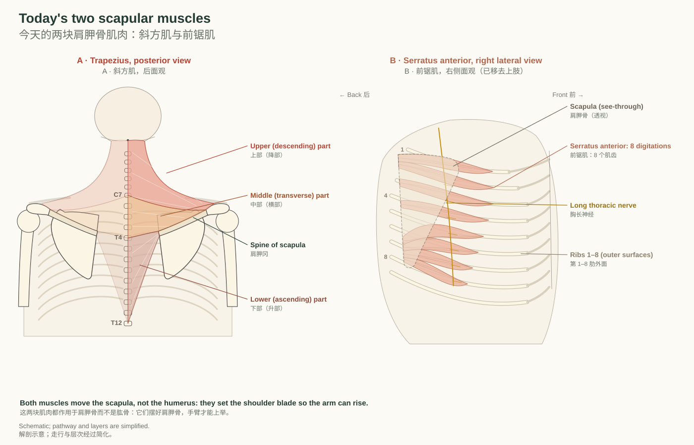
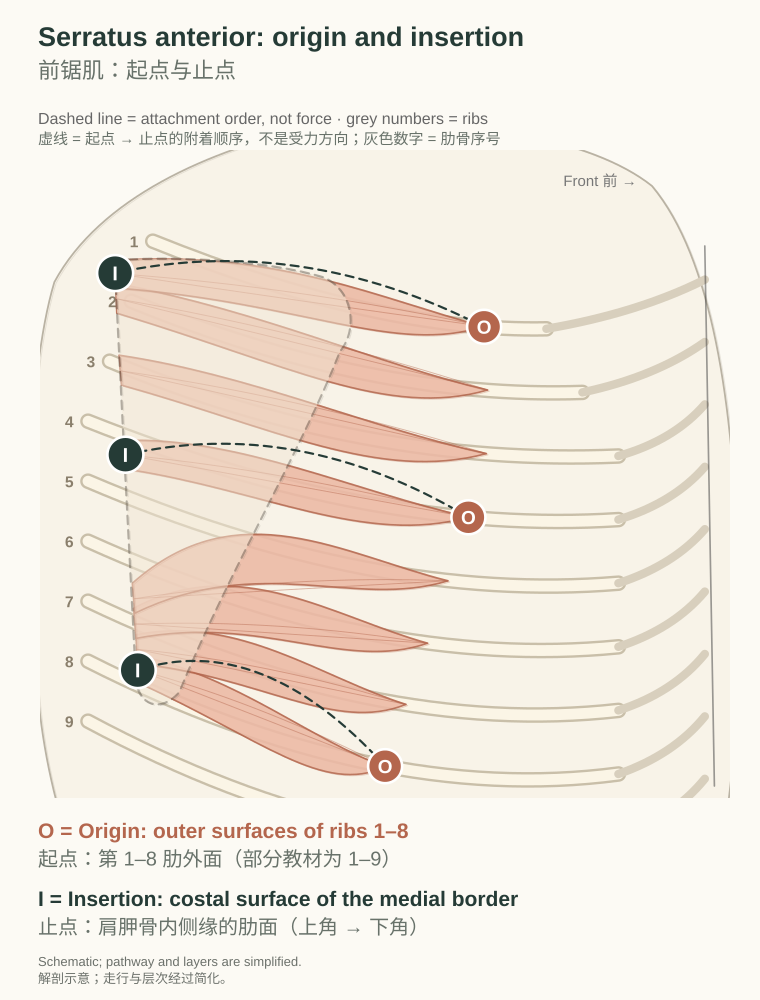
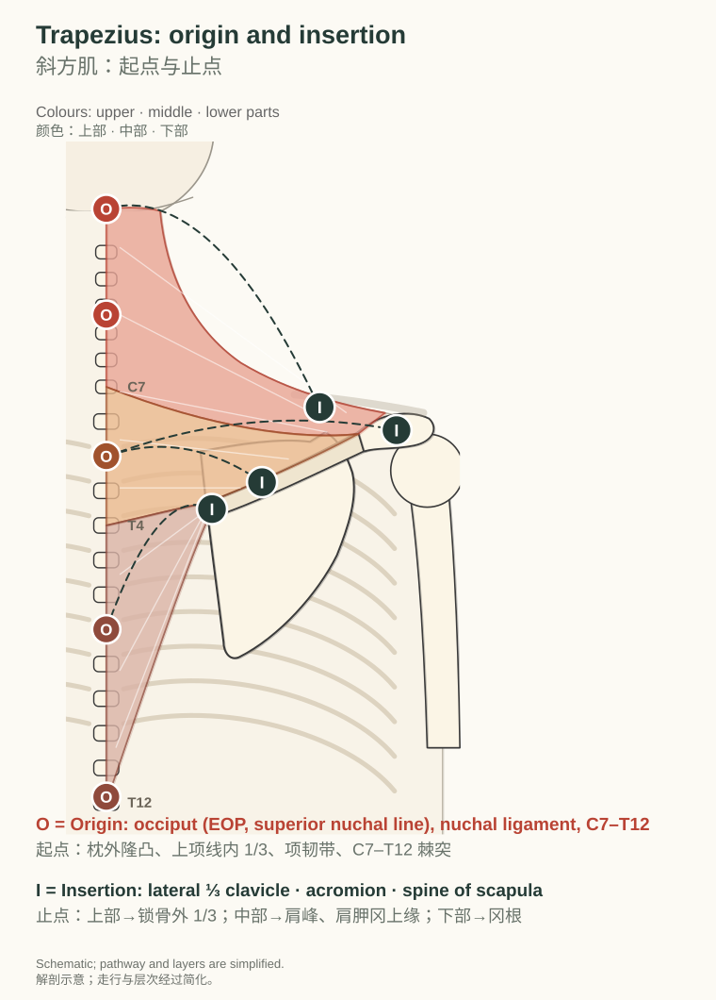
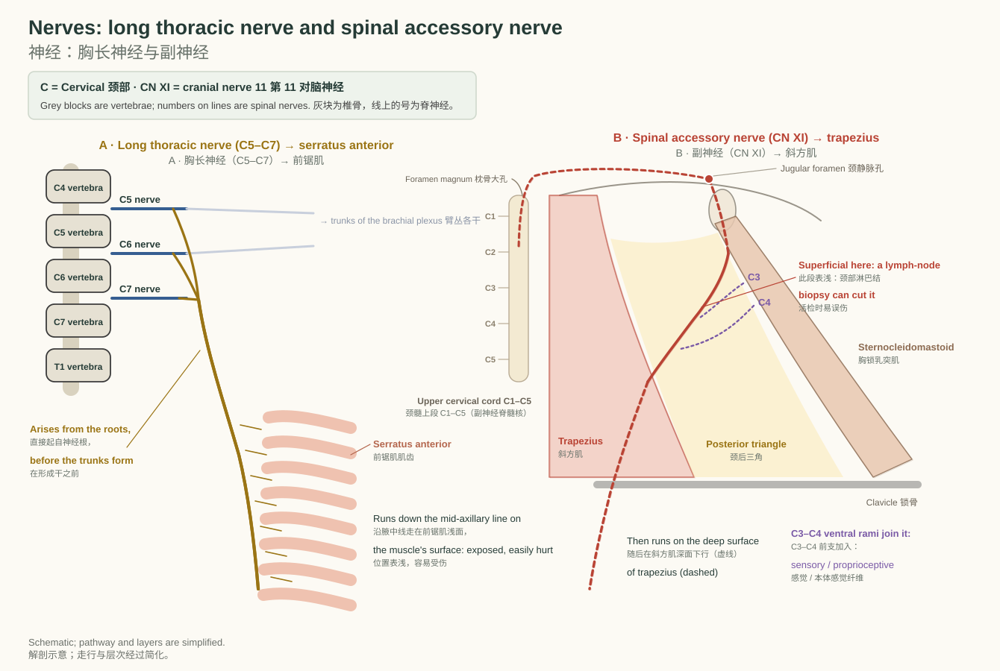
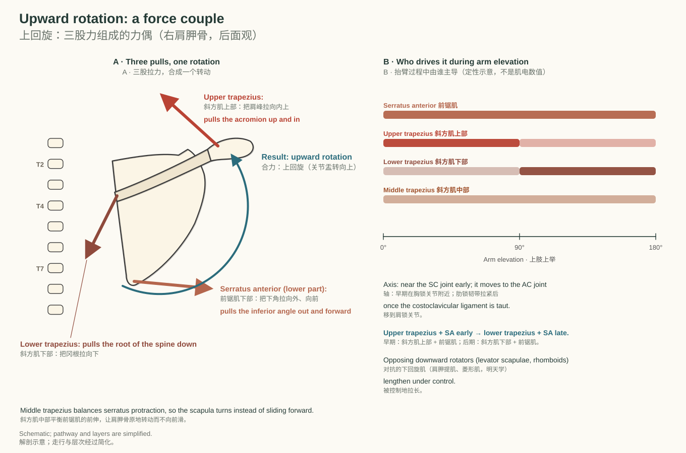
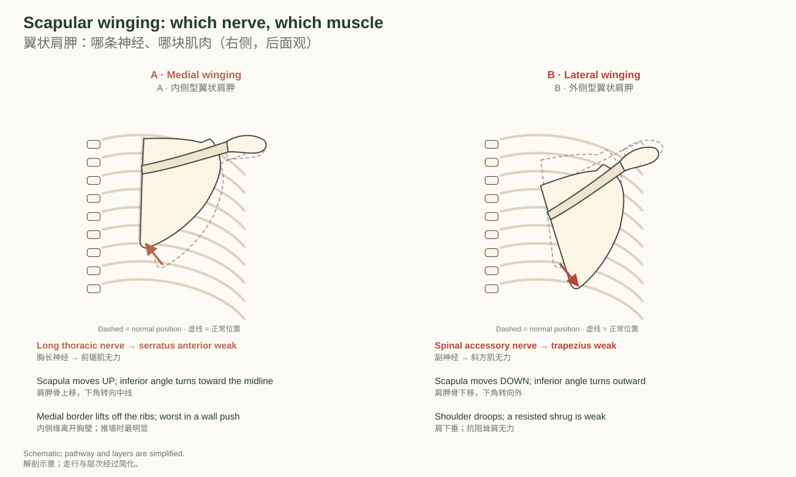
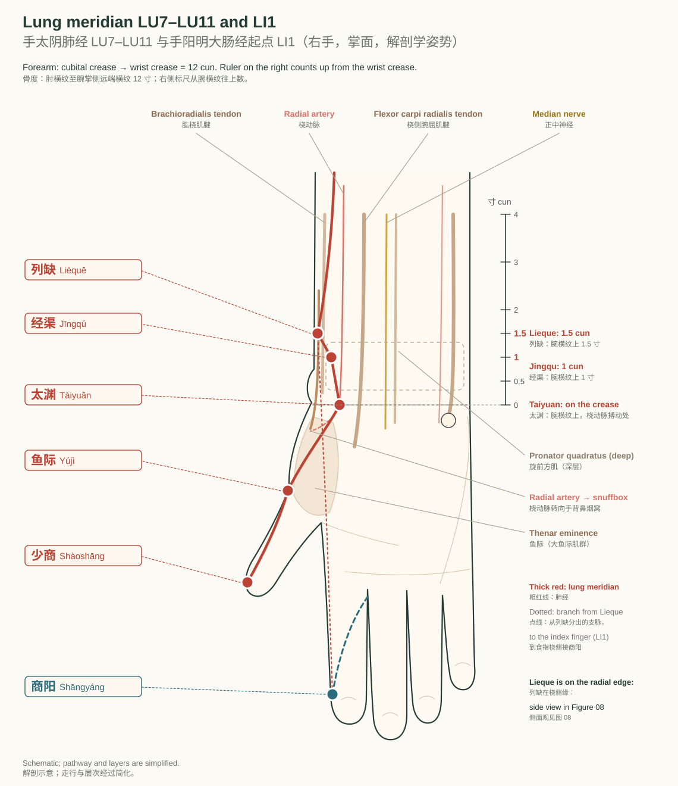
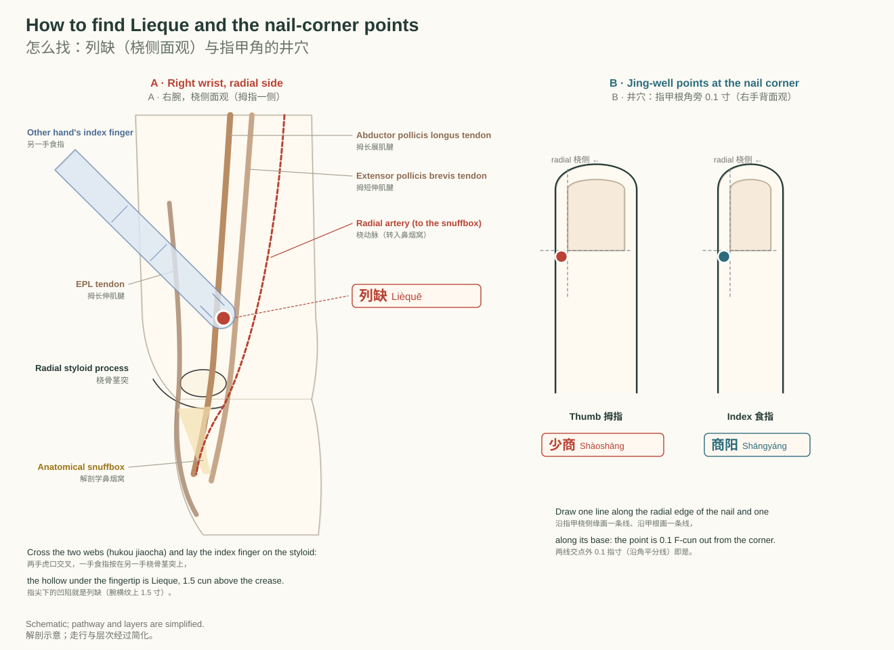
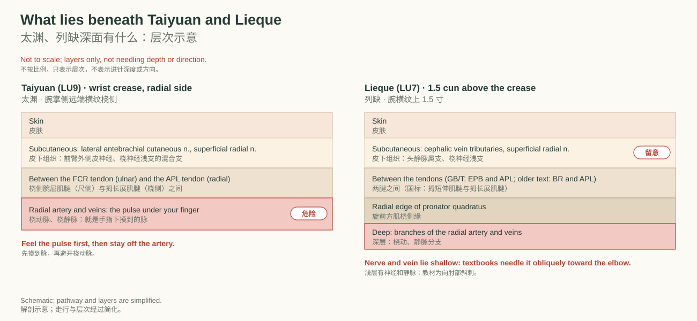

# 第 2 天｜肺经收尾与肩胛肌

DPT 基础 · 2026-10-08 · LU7–LU11 + LI1 · Serratus anterior and trapezius

## 01 Muscles: serratus anterior and trapezius

今日肌肉：前锯肌与斜方肌

> **After this chapter you can｜读完本章，你能够**
> 1. Name both muscles in English and Chinese and say which bone each one moves. 用英文和中文说出两块肌肉，并说出它们带动的是哪块骨。
> 2. State origin, insertion, nerve and action of each, part by part for trapezius. 说出两块肌肉的起点、止点、神经和动作，斜方肌按三部分说。
> 3. Feel both on yourself: a wall push and a shrug. 在自己身上摸到它们：推墙和耸肩。
>
> **Key terms｜关键词：** Serratus anterior（前锯肌） `ser-AY-tuhs an-TEER-ee-er` /sɛˈreɪtəs ænˈtɪriər/ · Trapezius（斜方肌） `truh-PEE-zee-uhs` /trəˈpiziəs/ · [Scapula](http://127.0.0.1:5178/?term=scapula)（肩胛骨） `SKAP-yuh-luh` /ˈskæpjələ/ · Medial border（内侧缘） `MEE-dee-uhl BOR-der` /ˈmidiəl ˈbɔrdər/ · Inferior angle（下角） `in-FEER-ee-er ANG-guhl` /ɪnˈfɪriər ˈæŋɡəl/ · Spine of [scapula](http://127.0.0.1:5178/?term=scapula)（肩胛冈） `SPYNE uhv SKAP-yuh-luh` /spaɪn əv ˈskæpjələ/ · [Acromion](http://127.0.0.1:5178/?term=acromion)（肩峰） `uh-KROH-mee-uhn` /əˈkroʊmiən/ · Spinous process（棘突） `SPY-nuhs PRAH-ses` /ˈspaɪnəs ˈprɑsɛs/ · Ligamentum nuchae（项韧带） `lig-uh-MEN-tuhm NOO-kee` /ˌlɪɡəˈmɛntəm ˈnuki/

Yesterday's pectoral muscles pull on the [humerus](http://127.0.0.1:5178/?term=humerus) and the coracoid. Today's two muscles anchor the [scapula](http://127.0.0.1:5178/?term=scapula) itself: the trapezius covers the back of the neck and upper back, and the serratus anterior wraps around the side of the chest and slips under the [scapula](http://127.0.0.1:5178/?term=scapula) to its medial border.

昨天的胸前肌拉的是肱骨和喙突。今天的两块肌肉直接固定肩胛骨本身：斜方肌覆盖颈后和上背部；前锯肌绕过胸廓侧面，钻到肩胛骨深面，止于内侧缘。

*A: trapezius in posterior view, its three parts coloured. B: serratus anterior in right lateral view with the upper limb removed; the [scapula](http://127.0.0.1:5178/?term=scapula) is drawn see-through.*  
*A：斜方肌后面观，三部分分色。B：前锯肌右侧面观（已移去上肢），肩胛骨画成透明。*

### Origins, insertions, and course｜起点、止点与走行

O = origin; I = insertion. The dashed O → I line shows the attachment order only; the pulls and the rotation they produce are drawn with solid arrows in Chapter 03.

O 表示起点，I 表示止点。虚线 O → I 只表示附着顺序；拉力和由此产生的转动在第 03 章用实线箭头表示。

#### Serratus anterior｜前锯肌

- **Origin 起点**：Outer surfaces of ribs 1–8 (some texts: 1–9), by fleshy digitations｜第 1–8 肋外面（部分教材为第 1–9 肋），以肌齿起始
- **Insertion 止点**：Costal (anterior) surface of the medial border of the [scapula](http://127.0.0.1:5178/?term=scapula), from the superior angle to the inferior angle｜肩胛骨内侧缘的肋面（前面），从上角到下角
- **Nerve 神经**：Long thoracic nerve (C5–C7), which arises directly from the roots of the brachial plexus｜胸长神经（C5–C7），直接起自臂丛的神经根
- **Action 动作**：Protracts the [scapula](http://127.0.0.1:5178/?term=scapula) and holds its medial border against the chest wall; the lower part rotates the [scapula](http://127.0.0.1:5178/?term=scapula) upward, so the arm can rise above 90°｜使肩胛骨前伸，并让内侧缘贴紧胸壁；下部使肩胛骨上回旋，手臂才能上举超过 90°

The serratus anterior originates from the outer surfaces of the first eight (or nine) ribs, passes backward around the lateral thoracic wall, and inserts onto the anterior surface of the medial border of the [scapula](http://127.0.0.1:5178/?term=scapula), from the superior angle to the inferior angle.

前锯肌起自第1–8（或9）肋的外面，绕胸廓外侧壁向后走行，止于肩胛骨内侧缘的前面（从上角到下角）。

The long thoracic nerve runs down the anterior chest wall in the mid-axillary line on the superficial surface of serratus anterior. This exposed course is why the nerve is easily injured. The lateral thoracic artery also supplies the muscle.

胸长神经沿腋中线走在前锯肌的浅面，位置表浅，因此容易受伤。胸外侧动脉也供应此肌。

A long thoracic nerve injury paralyses serratus anterior and causes MEDIAL scapular winging: the [scapula](http://127.0.0.1:5178/?term=scapula) moves up and its inferior angle rotates toward the midline. Patients have trouble flexing the shoulder past about 120°. To test, have the patient do a push-up (or wall push) with the shoulders flexed to 90°. Causes include radical mastectomy, axillary node dissection, chest drains, first-rib resection, compression or entrapment by the scalenes, and traction.

胸长神经损伤使前锯肌瘫痪，出现“内侧型翼状肩胛”：肩胛骨上移，下角转向中线。患者肩前屈很难超过约120°。检查方法：让患者在肩前屈90°时做俯卧撑（或推墙）。病因包括根治性乳房切除术、腋窝淋巴结清扫、胸腔引流、第1肋切除、斜角肌压迫或卡压，以及牵拉伤。

Feel it: flex your arm forward and push (or punch) against resistance, such as a wall. Put the fingertips of your other hand on the side of your rib cage just below the armpit. You can feel the saw-tooth digitations tighten over the ribs.

自己摸：上肢前屈，抵抗阻力向前推（如推墙或出拳）。用另一手指尖放在腋下稍下方的胸廓侧面，可摸到锯齿状肌齿在肋骨上收紧。

穴位锚点：大包 SP21 在其下部肌齿表面（第 6 肋间隙、腋中线上，脾经时再学）

#### Trapezius｜斜方肌

- **Origin 起点**：External occipital protuberance, medial third of the superior nuchal line, ligamentum nuchae, and the spinous processes of C7–T12｜枕外隆凸、上项线内侧 1/3、项韧带及 C7–T12 棘突
- **Insertion 止点**：Lateral third of the [clavicle](http://127.0.0.1:5178/?term=clavicle) (upper part); medial margin of the [acromion](http://127.0.0.1:5178/?term=acromion) and upper crest of the scapular spine (middle part); medial end of the spine (lower part)｜锁骨外侧 1/3（上部）；肩峰内侧缘和肩胛冈上缘（中部）；肩胛冈内侧端，即冈根（下部）
- **Nerve 神经**：Motor: spinal accessory nerve (CN XI). Sensory and proprioceptive: ventral rami of C3–C4｜运动：副神经（第 XI 对脑神经）。感觉与本体感觉：C3–C4 前支
- **Action 动作**：Upper fibres elevate and upwardly rotate the [scapula](http://127.0.0.1:5178/?term=scapula) (and extend the head and neck); middle fibres retract it; lower fibres depress it and help rotate it upward｜上部纤维使肩胛骨上提、上回旋（并使头颈后伸）；中部使其后缩；下部使其下降并协助上回旋

The trapezius originates from the external occipital protuberance, the superior nuchal line, the ligamentum nuchae and the spinous processes of C7–T12, passes laterally as converging upper, middle and lower fibers, and inserts onto the lateral third of the [clavicle](http://127.0.0.1:5178/?term=clavicle), the [acromion](http://127.0.0.1:5178/?term=acromion) and the spine of the [scapula](http://127.0.0.1:5178/?term=scapula).

斜方肌起自枕外隆凸、上项线、项韧带及C7–T12棘突，以上、中、下三部纤维向外侧汇聚，止于锁骨外侧1/3、肩峰和肩胛冈。

The spinal accessory nerve leaves the skull through the jugular foramen, crosses the posterior triangle of the neck, then passes beneath (deep to) the trapezius to supply it. The anterior margin of trapezius forms the posterior border of the posterior triangle. Trapezius covers the rhomboids, the lower part of levator scapulae, serratus posterior superior and the splenius/erector spinae group.

副神经经颈静脉孔出颅，穿过颈后三角，再走到斜方肌深面并支配该肌。斜方肌前缘构成颈后三角的后界。斜方肌覆盖菱形肌、肩胛提肌下部、上后锯肌以及夹肌/竖脊肌群。

Spinal accessory nerve injury in the posterior triangle is most often iatrogenic, for example during cervical lymph node biopsy or excision. When the nerve is injured within the posterior triangle, only trapezius is denervated. The result is trapezius wasting, shoulder droop, weak shrug and abduction, and LATERAL scapular winging: the [scapula](http://127.0.0.1:5178/?term=scapula) moves down and its inferior angle rotates outward. Test it with a resisted shoulder shrug.

颈后三角内的副神经损伤最常为医源性，例如颈部淋巴结活检或切除时。若损伤发生在颈后三角内，只有斜方肌失神经。表现为斜方肌萎缩、肩下垂、耸肩和外展无力，以及“外侧型翼状肩胛”：肩胛骨下移，下角向外旋。检查方法：抗阻耸肩。

Feel it: upper fibers: rest the fingers of your opposite hand on the top of your shoulder, between the neck and the [acromion](http://127.0.0.1:5178/?term=acromion), and shrug against your own downward pressure. The thick upper border tightens under your fingers. (Clinicians test it the same way, with a resisted shrug.)

自己摸：上部纤维：用对侧手指放在颈与肩峰之间的肩上缘，对抗自己向下的压力耸肩，可感到肥厚的上缘在指下收紧。（临床以抗阻耸肩检查。）

穴位锚点：肩井 GB21 在其上部纤维上（胆经时再学）；秉风、曲垣在其深面的冈上窝

#### How to remember them｜三步记住这两块肌肉

1. **Feel 摸**：Push against a wall with your arm forward and feel the saw-tooth slips under your armpit: serratus anterior. Shrug against your other hand's pressure and feel the thick upper border tighten: upper trapezius. 手臂前伸推墙，腋下稍下方能摸到锯齿状的肌齿在收紧：前锯肌。另一只手向下压着肩，同时耸肩，肩上缘变硬：斜方肌上部。
2. **Draw 画**：Draw a kite from the occiput down to T12 and out to both acromia: that is the pair of trapezius muscles. Then draw eight tongues from ribs 1–8 sweeping back under the [scapula](http://127.0.0.1:5178/?term=scapula): serratus anterior. 从枕骨画到 T12，再向两侧连到肩峰，画成一个风筝形：左右两块斜方肌。再从第 1–8 肋画 8 条舌形肌齿，向后钻到肩胛骨下面：前锯肌。
3. **Move 动**：Punch forward (serratus: protraction), shrug (upper trapezius: elevation), squeeze the shoulder blades together (middle trapezius: retraction), then raise both arms overhead and feel all three turn the [scapula](http://127.0.0.1:5178/?term=scapula) upward. 向前出拳（前锯肌：前伸）、耸肩（斜方肌上部：上提）、夹紧两侧肩胛骨（斜方肌中部：后缩），最后双臂上举，体会三股力一起让肩胛骨上回旋。

**Number hook 数字钩子**：SA: ribs 1–8, C5–C7 · Trap: C7–T12, CN XI（前锯肌——肋 1–8、C5–C7；斜方肌——C7–T12 棘突、副神经）

#### Check yourself｜先自测

**Q.** Which surface of the [scapula](http://127.0.0.1:5178/?term=scapula) does the serratus anterior attach to, and why can't you see it from behind? 前锯肌附着在肩胛骨的哪一面？为什么从后面看不到？

Answer 答案

The costal (anterior) surface of the medial border. It lies between the [scapula](http://127.0.0.1:5178/?term=scapula) and the ribs, hidden under the [scapula](http://127.0.0.1:5178/?term=scapula). 附着在内侧缘的肋面（前面）。它夹在肩胛骨和肋骨之间，被肩胛骨挡住。

**Q.** Where does each part of the trapezius insert? 斜方肌三部分分别止于哪里？

Answer 答案

Upper fibres: lateral third of the [clavicle](http://127.0.0.1:5178/?term=clavicle). Middle fibres: medial [acromion](http://127.0.0.1:5178/?term=acromion) and the upper crest of the scapular spine. Lower fibres: the root (medial end) of the spine. 上部：锁骨外侧 1/3；中部：肩峰内侧缘与肩胛冈上缘；下部：肩胛冈内侧端（冈根）。

> **Take-home 本章要点：** Serratus anterior: ribs 1–8 → costal surface of the medial border. Trapezius: occiput and C7–T12 → lateral [clavicle](http://127.0.0.1:5178/?term=clavicle), [acromion](http://127.0.0.1:5178/?term=acromion) and scapular spine, in three parts.  
> 前锯肌：第 1–8 肋 → 内侧缘肋面。斜方肌：枕骨与 C7–T12 → 锁骨外侧、肩峰和肩胛冈，分上、中、下三部。

## 02 Innervation: long thoracic and spinal accessory nerves

神经支配：胸长神经与副神经

> **After this chapter you can｜读完本章，你能够**
> 1. Trace the long thoracic nerve from C5–C7 to the serratus anterior. 从 C5–C7 追踪胸长神经到前锯肌。
> 2. Trace the spinal accessory nerve from the upper cervical cord to the trapezius. 从颈髓上段追踪副神经到斜方肌。
> 3. Explain where each nerve is exposed and what happens when it is cut. 说出每条神经在哪里位置表浅，损伤后会怎样。
>
> **Key terms｜关键词：** Long thoracic nerve（胸长神经） `LONG thuh-RAS-ik NURV` /lɔŋ θəˈræsɪk nɝv/ · Spinal accessory nerve（副神经） `SPY-nuhl ik-SES-uh-ree NURV` /ˈspaɪnəl ɪkˈsɛsəri nɝv/ · Cranial nerve（脑神经） `KRAY-nee-uhl NURV` /ˈkreɪniəl nɝv/ · Posterior triangle（颈后三角） `pah-STEER-ee-er TRY-ang-guhl` /pɑˈstɪriər ˈtraɪˌæŋɡəl/ · Brachial plexus（臂丛） `BRAY-kee-uhl PLEK-suhs` /ˈbreɪkiəl ˈplɛksəs/

> **C = Cervical · 颈部   CN = Cranial nerve · 脑神经** — C5–C7 神经根直接发出 → 胸长神经 → 前锯肌；CN XI 副神经（运动）→ 斜方肌（也支配胸锁乳突肌）；C3–C4 前支加入：斜方肌的感觉与本体感觉纤维

*A: the long thoracic nerve leaves the C5–C7 roots before the trunks form and runs down the mid-axillary line on the serratus surface. B: the spinal accessory nerve rises from the upper cervical cord, enters the skull through the foramen magnum, exits through the jugular foramen, crosses the posterior triangle and runs on the deep surface of the trapezius.*  
*A：胸长神经在形成干之前直接由 C5–C7 神经根发出，沿腋中线走在前锯肌表面。B：副神经起自颈髓上段，经枕骨大孔入颅，再经颈静脉孔出颅，穿过颈后三角，在斜方肌深面下行。*

The long thoracic nerve (C5–C7) arises directly from the roots of the brachial plexus. It descends behind the plexus and then runs down the lateral chest wall, in the mid-axillary line, on the outer surface of the serratus anterior. Because it lies on top of the muscle it supplies, it is easily injured by surgery in the axilla or by traction.

胸长神经（C5–C7）直接起自臂丛的神经根，在臂丛后方下行，然后沿腋中线走在胸外侧壁、前锯肌的外表面。它走在自己所支配肌肉的表面，所以腋窝手术或牵拉时容易受伤。

The spinal accessory nerve (CN XI) is the motor nerve of the trapezius. Its fibres rise from the upper cervical spinal cord, enter the skull through the foramen magnum and leave it again through the jugular foramen. The nerve supplies the sternocleidomastoid, crosses the posterior triangle of the neck just under the skin, and then passes deep to the trapezius. Ventral rami of C3 and C4 join it and carry sensory and proprioceptive fibres.

副神经（第 XI 对脑神经）是斜方肌的运动神经。它的纤维起自颈髓上段，经枕骨大孔入颅，再经颈静脉孔出颅；先支配胸锁乳突肌，然后在皮下穿过颈后三角，再走到斜方肌深面。C3、C4 的前支加入，携带感觉和本体感觉纤维。

**记法：** Long → medial：胸长神经损伤 → 内侧型翼状肩胛；Accessory → lateral：副神经损伤 → 外侧型翼状肩胛（图 06）。

#### Check yourself｜先自测

**Q.** Which nerve supplies serratus anterior, from which roots, and what sign appears when it is injured? 前锯肌由哪条神经支配？来自哪些神经根？损伤后出现什么体征？

Answer 答案

The long thoracic nerve (C5–C7). Injury causes medial scapular winging: the [scapula](http://127.0.0.1:5178/?term=scapula) translates upward and its inferior angle rotates medially. The winging is easiest to see during a push-up or wall push with the shoulders flexed to 90°. 胸长神经（C5–C7）。损伤后出现内侧型翼状肩胛：肩胛骨上移，下角向内旋转。在肩前屈90°做俯卧撑或推墙时最明显。

**Q.** Why is the spinal accessory nerve at risk during a lymph-node biopsy in the neck? 为什么颈部淋巴结活检时副神经容易受伤？

Answer 答案

Between the sternocleidomastoid and the trapezius it crosses the posterior triangle just under the skin, where the lymph nodes are. In the posterior triangle only the trapezius is denervated. 它在胸锁乳突肌和斜方肌之间、紧贴皮下穿过颈后三角，正是淋巴结所在的位置。若损伤发生在颈后三角，只有斜方肌失神经。

> **Take-home 本章要点：** Long thoracic nerve: C5–C7 roots → serratus anterior, exposed on the chest wall. Spinal accessory nerve: CN XI → trapezius (C3–C4 add sensory fibres), exposed in the posterior triangle.  
> 胸长神经：C5–C7 神经根 → 前锯肌，在胸壁表面走行。副神经：CN XI → 斜方肌（C3–C4 带来感觉纤维），在颈后三角位置表浅。

## 03 Movement: the upward-rotation force couple

动作：上回旋力偶

> **After this chapter you can｜读完本章，你能够**
> 1. Name the three pulls that rotate the [scapula](http://127.0.0.1:5178/?term=scapula) upward and where each one acts. 说出使肩胛骨上回旋的三股拉力，以及各自作用在哪里。
> 2. Explain how the partners change between early and late elevation. 说明上举早期和后期配对如何变化。
> 3. Tell medial from lateral winging and link each to its nerve. 区分内侧型和外侧型翼状肩胛，并对应到神经。
>
> **Key terms｜关键词：** Upward rotation（上回旋） `UP-werd roh-TAY-shuhn` /ˈʌpwərd roʊˈteɪʃən/ · Force couple（力偶） `FORS KUP-uhl` /fɔrs ˈkʌpəl/ · Protraction（前伸） `proh-TRAK-shuhn` /proʊˈtrækʃən/ · Retraction（后缩） `rih-TRAK-shuhn` /rɪˈtrækʃən/ · Elevation（上提） `el-uh-VAY-shuhn` /ˌɛləˈveɪʃən/ · Scapular winging（翼状肩胛） `SKAP-yuh-ler WING-ing` /ˈskæpjələr ˈwɪŋɪŋ/

*A: upper trapezius pulls the [acromion](http://127.0.0.1:5178/?term=acromion) up and in, lower trapezius pulls the root of the spine down, and the lower serratus pulls the inferior angle out and forward; together they rotate the [scapula](http://127.0.0.1:5178/?term=scapula) upward. B: who leads during arm elevation (qualitative, not EMG values).*  
*A：斜方肌上部把肩峰拉向内上，下部把冈根拉向下，前锯肌下部把下角拉向外前方，三者合起来使肩胛骨上回旋。B：抬臂过程中由谁主导（定性示意，不是肌电数值）。*

Raising the arm overhead needs the glenoid to turn upward. Three pulls acting on different points of the [scapula](http://127.0.0.1:5178/?term=scapula) produce this rotation: the upper trapezius at the lateral [clavicle](http://127.0.0.1:5178/?term=clavicle) and [acromion](http://127.0.0.1:5178/?term=acromion), the lower trapezius at the root of the spine, and the lower part of the serratus anterior at the inferior angle. Pulls on different points, turning the same bone the same way, form a force couple.

手臂举过头需要关节盂转向上。三股拉力作用在肩胛骨的不同位置，合成这个转动：斜方肌上部拉锁骨外侧和肩峰，斜方肌下部拉冈根，前锯肌下部拉下角。作用在不同点、使同一块骨朝同一方向转动的几股力，就叫力偶。

Early in elevation the upper trapezius and serratus anterior rotate the [scapula](http://127.0.0.1:5178/?term=scapula) around an axis near the sternoclavicular joint. Once the costoclavicular ligament becomes taut, the axis moves to the acromioclavicular joint and the lower trapezius takes over from the upper part. The middle trapezius retracts the [scapula](http://127.0.0.1:5178/?term=scapula) and balances serratus protraction, so the [scapula](http://127.0.0.1:5178/?term=scapula) turns instead of sliding forward.

上举早期，斜方肌上部和前锯肌使肩胛骨围绕胸锁关节附近的轴转动。肋锁韧带拉紧后，旋转轴移到肩锁关节，由斜方肌下部接替上部。斜方肌中部使肩胛骨后缩，平衡前锯肌的前伸，让肩胛骨原地转动而不向前滑。

*A: medial winging (long thoracic nerve, serratus anterior). B: lateral winging (spinal accessory nerve, trapezius). Dashed outlines show the normal position.*  
*A：内侧型翼状肩胛（胸长神经、前锯肌）。B：外侧型翼状肩胛（副神经、斜方肌）。虚线为正常位置。*

If the serratus anterior is weak, it can no longer hold the [scapula](http://127.0.0.1:5178/?term=scapula) against the chest wall: the [scapula](http://127.0.0.1:5178/?term=scapula) rides up, its inferior angle swings toward the midline and the medial border lifts off, most clearly during a wall push. If the trapezius is weak, the shoulder droops: the [scapula](http://127.0.0.1:5178/?term=scapula) sits lower, its inferior angle turns outward, and a resisted shrug is weak.

前锯肌无力时，肩胛骨不能贴紧胸壁：肩胛骨上移，下角转向中线，内侧缘翘起，推墙时最明显。斜方肌无力时，肩下垂：肩胛骨位置偏低，下角转向外，抗阻耸肩无力。

#### Check yourself｜先自测

**Q.** Name the muscles of the upward-rotation force couple and explain how the pairing changes during arm elevation. 说出上回旋力偶的组成肌肉，并说明上举过程中配对如何变化。

Answer 答案

Upper trapezius, lower trapezius and serratus anterior. Early on, the upper trapezius and serratus anterior rotate the [scapula](http://127.0.0.1:5178/?term=scapula) around a sternoclavicular axis. After the costoclavicular ligament tightens, the axis moves to the acromioclavicular joint and the lower trapezius and serratus anterior produce the rotation. 斜方肌上部、斜方肌下部和前锯肌。早期由斜方肌上部和前锯肌围绕胸锁关节轴使肩胛骨上回旋；肋锁韧带拉紧后，旋转轴移到肩锁关节，由斜方肌下部和前锯肌产生上回旋。

**Q.** A patient's [scapula](http://127.0.0.1:5178/?term=scapula) rides up and its medial border lifts off during a wall push. Which muscle and nerve? 患者推墙时肩胛骨上移、内侧缘翘起。是哪块肌肉、哪条神经？

Answer 答案

Serratus anterior, long thoracic nerve: medial winging. 前锯肌，胸长神经：内侧型翼状肩胛。

> **Take-home 本章要点：** Upward rotation = upper trapezius + lower trapezius + serratus anterior, pulling at three points of the [scapula](http://127.0.0.1:5178/?term=scapula); middle trapezius keeps it from sliding forward.  
> 上回旋 = 斜方肌上部 + 斜方肌下部 + 前锯肌，在肩胛骨三个点上拉；斜方肌中部防止它向前滑。

## 04 Acupoints: LU7–LU11 and LI1

穴位：肺经 LU7–LU11 与大肠经商阳

> **After this chapter you can｜读完本章，你能够**
> 1. Locate Lieque, Jingqu, Taiyuan, Yuji, Shaoshang and Shangyang on your own hand. 在自己手上找到列缺、经渠、太渊、鱼际、少商、商阳。
> 2. Use the forearm cun and the nail-corner rule to place them. 用前臂骨度分寸和指甲角法定位。
> 3. Name the radial artery and the tendons around each point. 说出每个穴位旁边的桡动脉和肌腱。
>
> **Key terms｜关键词：** 列缺（Lièquē） · 经渠（Jīngqú） · 太渊（Tàiyuān） · 鱼际（Yújì） · 少商（Shàoshāng） · 商阳（Shāngyáng）

From Kongzui the lung meridian runs to the radial side of the wrist: Lieque on the radial edge, Jingqu and Taiyuan beside the radial pulse, then across the thenar eminence (Yuji) to the radial corner of the thumbnail (Shaoshang). A branch from Lieque goes to the radial side of the index finger, where the large intestine meridian begins at Shangyang.

肺经从孔最下行到腕部桡侧：列缺在桡侧缘，经渠、太渊在桡动脉搏动处旁，再经大鱼际（鱼际）到拇指指甲桡侧角（少商）。从列缺分出的支脉到食指桡侧，大肠经由此从商阳开始。

*Right hand, palm forward. Red: lung meridian points; teal: LI1. The ruler on the ulnar side counts cun up from the distal wrist crease. The radial artery is drawn in a lighter red than the meridian.*  
*右手掌面（解剖学姿势）。红点为肺经穴，青色为商阳；尺侧标尺从腕掌侧远端横纹往上数寸。桡动脉用比经络浅的红色画出。*

#### 列缺（Lièquē）

- 定位：在前臂外侧，腕掌侧远端横纹上 1.5 寸，拇短伸肌腱与拇长展肌腱之间，拇长展肌腱沟的凹陷中
- 层次：皮肤 → 皮下组织（头静脉属支、桡神经浅支）→ 拇短伸肌腱与拇长展肌腱之间（旧教材作：肱桡肌腱与拇长展肌腱之间）→ 旋前方肌桡侧缘
- 安全：浅层有头静脉属支和桡神经浅支；教材刺法为向肘部斜刺
- 相关肌肉：拇长展肌腱、拇短伸肌腱；深面旋前方肌
- 特定穴：络穴；八脉交会穴（通任脉）
- 怎么找：两手虎口交叉，一手食指按在另一手桡骨茎突上，指尖下的凹陷就是列缺（见图 08）

#### 经渠（Jīngqú）

- 定位：在前臂前外侧，腕掌侧远端横纹上 1 寸，桡骨茎突与桡动脉之间
- 层次：皮肤 → 皮下组织（前臂外侧皮神经、桡神经浅支）→ 桡侧腕屈肌腱与拇长展肌腱之间，桡动、静脉的桡侧 → 旋前方肌
- 安全：紧贴桡动脉的桡侧：避开动脉；教材记载禁灸
- 相关肌肉：桡侧腕屈肌腱、拇长展肌腱；深面旋前方肌
- 特定穴：经穴（五输穴之经穴，肺经“所行为经”）
- 怎么找：太渊上 1 寸，约平腕掌侧近端横纹；在桡骨茎突内缘与桡动脉之间的凹陷

#### 太渊（Tàiyuān）

- 定位：在腕前外侧，桡骨茎突与腕舟状骨之间，拇长展肌腱尺侧凹陷中（腕掌侧远端横纹桡侧，桡动脉搏动处）
- 层次：皮肤 → 皮下组织（前臂外侧皮神经、桡神经浅支）→ 桡侧腕屈肌腱与拇长展肌腱之间，桡动、静脉所在
- 安全：穴位就在桡动脉上：先摸到脉，再避开动脉
- 相关肌肉：拇长展肌腱、桡侧腕屈肌腱
- 特定穴：输穴；原穴；八会穴之脉会（教材A：“穴属俞土，系原穴”）
- 怎么找：仰掌，在腕掌侧远端横纹的桡侧端摸到桡动脉搏动，即拇长展肌腱尺侧的凹陷

#### 鱼际（Yújì）

- 定位：在手掌，第1掌骨桡侧中点赤白肉际处。
- 层次：皮肤 → 皮下组织（前臂外侧皮神经、正中神经分支）→ 拇短展肌 → 拇对掌肌（旧教材写作“拇指掌肌”）
- 安全：皮下有前臂外侧皮神经与正中神经分支
- 相关肌肉：拇短展肌、拇对掌肌（大鱼际肌）
- 特定穴：荥穴（教材A：“肺之荥火穴”）
- 怎么找：仰掌，在第 1 掌骨中点的桡侧，手掌与手背皮肤交界的赤白肉际处

#### 少商（Shàoshāng）

- 定位：在手指，拇指末节桡侧，指甲根角侧上方0.1寸。
- 层次：皮肤 → 皮下组织（指端动脉网；桡神经、正中神经的分支）
- 安全：穴下只有皮下组织：教材为浅刺或点刺出血
- 相关肌肉：无（穴下只有皮下组织）
- 特定穴：井穴（肺经井穴）
- 怎么找：拇指桡侧，沿指甲桡侧缘与甲根各画一线，交点外 0.1 寸（沿角平分线，见图 08）

#### 商阳（Shāngyáng）

- 定位：在手指，食指末节桡侧，指甲根角侧上方0.1寸。
- 层次：皮肤 → 皮下组织（指端动脉网；正中神经的指掌侧固有神经）
- 安全：穴下只有皮下组织：教材为浅刺或点刺出血
- 相关肌肉：无（穴下只有皮下组织）
- 特定穴：井穴（大肠经井穴；教材A称“井金穴”）
- 怎么找：食指桡侧，沿指甲桡侧缘与甲根各画一线，交点外 0.1 寸（见图 08）

### How to find them｜怎么找

*A: radial side of the right wrist. Lieque lies in the groove between the EPB and APL tendons, 1.5 cun above the crease; with the webs of both hands crossed, the index fingertip lands on it. B: jing-well points 0.1 F-cun out from the radial corner of the nail.*  
*A：右腕桡侧面观。列缺在拇短伸肌腱与拇长展肌腱之间的沟中，腕横纹上 1.5 寸；两手虎口交叉时食指尖正落在这里。B：井穴在指甲桡侧角外 0.1 指寸。*

### What lies beneath Taiyuan and Lieque｜太渊、列缺深面有什么

*Layers from skin to deep structures. Not to scale and not a needling depth.*  
*从皮肤到深层结构的层次；不按比例，不表示进针深度。*

At the wrist the radial artery lies between the flexor carpi radialis tendon and the abductor pollicis longus tendon. Taiyuan sits on it and Jingqu just radial to it, so the pulse is the landmark to find and the structure to avoid. At Lieque, the cephalic vein tributaries and the superficial branch of the radial nerve lie just under the skin.

在腕部，桡动脉位于桡侧腕屈肌腱与拇长展肌腱之间。太渊就在动脉上，经渠紧贴其桡侧，所以脉搏既是定位标志，也是要避开的结构。列缺处，头静脉属支和桡神经浅支就在皮下。

#### Check yourself｜先自测

**Q.** Where is Lieque (LU7) by GB/T 12346-2021, and what are its special-point categories? Which nearby structures should you keep in mind when needling? 按 GB/T 12346-2021，列缺（LU7）位于何处？属于哪些特定穴？针刺时要注意附近哪些结构？

Answer 答案

LU7 is on the lateral forearm, 1.5 cun above the distal palmar wrist crease, between the extensor pollicis brevis and abductor pollicis longus tendons, in the groove of the APL tendon. It is the luo-connecting point of the Lung meridian and an eight-confluent (bamai jiaohui) point linked to the Conception Vessel (Ren mai). Tributaries of the cephalic vein and the superficial branch of the radial nerve lie superficially, so it is needled obliquely toward the elbow, 0.5–0.8 cun. 列缺在前臂外侧，腕掌侧远端横纹上1.5寸，拇短伸肌腱与拇长展肌腱之间，拇长展肌腱沟的凹陷中。为肺经络穴，八脉交会穴（通任脉）。浅层有头静脉属支和桡神经浅支，故向肘部斜刺0.5~0.8寸。

**Q.** Between which two tendons does Taiyuan lie, and what runs there? 太渊位于哪两条肌腱之间？那里有什么结构？

Answer 答案

Between the flexor carpi radialis tendon (ulnar side) and the abductor pollicis longus tendon (radial side); the radial artery and veins run there. 在桡侧腕屈肌腱（尺侧）与拇长展肌腱（桡侧）之间；桡动脉和桡静脉就在这里。

**Q.** Where exactly is Shaoshang? 少商的准确位置在哪里？

Answer 答案

On the radial side of the thumb, 0.1 F-cun out from the radial corner of the nail, where a line along the radial nail border meets a line along the nail base. 在拇指桡侧，指甲桡侧角外 0.1 指寸：沿指甲桡侧缘画线与沿甲根画线的交点处。

> **Take-home 本章要点：** Lieque: radial edge, 1.5 cun, between EPB and APL. Jingqu: 1 cun, beside the radial artery. Taiyuan: on the crease, on the radial pulse. Yuji: thenar edge, middle of the 1st metacarpal. Shaoshang and Shangyang: 0.1 F-cun from the radial nail corner of the thumb and index finger.  
> 列缺：桡侧缘，1.5 寸，拇短伸肌腱与拇长展肌腱之间。经渠：1 寸，紧贴桡动脉。太渊：腕横纹上，桡动脉搏动处。鱼际：第 1 掌骨中点桡侧赤白肉际。少商、商阳：拇指、食指指甲桡侧角外 0.1 指寸。

## 05 Review and recall

整理与复习

> **After this chapter you can｜读完本章，你能够**
> 1. Recall all six points and both muscles without looking. 不看页面，说出今天的 6 个穴位和 2 块肌肉。
>
> **Key terms｜关键词：** Origin（起点） `OR-uh-juhn` /ˈɔrədʒən/ · Insertion（止点） `in-SUR-shuhn` /ɪnˈsɝʃən/ · Innervation（神经支配） `in-er-VAY-shuhn` /ˌɪnərˈveɪʃən/

### 5.1 One-page summary｜5.1 一页总结

| Muscle 肌肉 | Origin 起点 | Insertion 止点 | Nerve 神经 | Action 动作 | Acupoint 穴位锚点 |
|---|---|---|---|---|---|
| Serratus anterior 前锯肌 | Ribs 1–8/9 (outer surfaces) 第1–8/9肋外面 | Medial border, costal surface (superior → inferior angle) 肩胛骨内侧缘肋面（上角至下角） | Long thoracic n. (C5–C7) 胸长神经（C5–C7） | Protraction; upward rotation (inferior part); holds [scapula](http://127.0.0.1:5178/?term=scapula) to thorax 前伸；上回旋（下部）；使肩胛骨贴紧胸壁 | Dabao (SP21) lies over its lower digitations in the 6th intercostal space, mid-axillary line (spleen meridian, later) 大包 SP21 在其下部肌齿表面（第 6 肋间隙、腋中线上，脾经时再学） |
| Trapezius 斜方肌 | Occiput, nuchal ligament, spinous processes C7–T12 枕骨、项韧带、C7–T12棘突 | Lateral ⅓ [clavicle](http://127.0.0.1:5178/?term=clavicle), [acromion](http://127.0.0.1:5178/?term=acromion), scapular spine 锁骨外1/3、肩峰、肩胛冈 | Spinal accessory n. (CN XI); C3–C4 sensory 副神经（CN XI）；C3–C4 感觉 | Upper: elevate + upward rotate · middle: retract · lower: depress + upward rotate 上部：上提 + 上回旋；中部：后缩；下部：下降 + 上回旋 | Jianjing (GB21) sits on its upper fibres (gallbladder meridian, later); Bingfeng and Quyuan lie deep to it in the supraspinous fossa 肩井 GB21 在其上部纤维上（胆经时再学）；秉风、曲垣在其深面的冈上窝 |

| Point 穴位 | Location 定位 | Layers 层次 | Safety 安全 |
|---|---|---|---|
| Lièquē 列缺 | Radial forearm, 1.5 B-cun above palmar wrist crease, in the APL tendon groove between the APL and EPB tendons. 在前臂外侧，腕掌侧远端横纹上 1.5 寸，拇短伸肌腱与拇长展肌腱之间，拇长展肌腱沟的凹陷中 |  皮肤 → 皮下组织（头静脉属支、桡神经浅支）→ 拇短伸肌腱与拇长展肌腱之间（旧教材作：肱桡肌腱与拇长展肌腱之间）→ 旋前方肌桡侧缘 |  浅层有头静脉属支和桡神经浅支；教材刺法为向肘部斜刺 |
| Jīngqú 经渠 | 1 B-cun above the palmar wrist crease, between the radial styloid process and the radial artery (1 B-cun above LU9). 在前臂前外侧，腕掌侧远端横纹上 1 寸，桡骨茎突与桡动脉之间 |  皮肤 → 皮下组织（前臂外侧皮神经、桡神经浅支）→ 桡侧腕屈肌腱与拇长展肌腱之间，桡动、静脉的桡侧 → 旋前方肌 |  紧贴桡动脉的桡侧：避开动脉；教材记载禁灸 |
| Tàiyuān 太渊 | Radial end of the palmar wrist crease, between radial styloid and scaphoid, ulnar to the APL tendon, over the radial pulse. 在腕前外侧，桡骨茎突与腕舟状骨之间，拇长展肌腱尺侧凹陷中（腕掌侧远端横纹桡侧，桡动脉搏动处） |  皮肤 → 皮下组织（前臂外侧皮神经、桡神经浅支）→ 桡侧腕屈肌腱与拇长展肌腱之间，桡动、静脉所在 |  穴位就在桡动脉上：先摸到脉，再避开动脉 |
| Yújì 鱼际 | Radial to the midpoint of the 1st metacarpal, at the palmar–dorsal skin junction (thenar eminence). 在手掌，第1掌骨桡侧中点赤白肉际处。 |  皮肤 → 皮下组织（前臂外侧皮神经、正中神经分支）→ 拇短展肌 → 拇对掌肌（旧教材写作“拇指掌肌”） |  皮下有前臂外侧皮神经与正中神经分支 |
| Shàoshāng 少商 | 0.1 F-cun proximal-lateral to the radial corner of the thumbnail. 在手指，拇指末节桡侧，指甲根角侧上方0.1寸。 |  皮肤 → 皮下组织（指端动脉网；桡神经、正中神经的分支） |  穴下只有皮下组织：教材为浅刺或点刺出血 |
| Shāngyáng 商阳 | 0.1 F-cun proximal-lateral to the radial corner of the index fingernail. 在手指，食指末节桡侧，指甲根角侧上方0.1寸。 |  皮肤 → 皮下组织（指端动脉网；正中神经的指掌侧固有神经） |  穴下只有皮下组织：教材为浅刺或点刺出血 |

### 5.2 The lung meridian song, now complete｜5.2 肺经穴歌：今天全部学完

**经穴歌（传统）：** 手太阴肺十一穴，中府云门天府诀，侠白尺泽孔最存，列缺经渠太渊涉，鱼际少商如韭叶。

With today's five points you have learned all eleven points of the lung meridian. Tomorrow the large intestine meridian continues from Shangyang along the index finger to the hand and wrist.

加上今天的 5 个，肺经 11 个穴位全部学完。明天大肠经从商阳沿食指继续到手背和腕部。

### 5.3 Pronunciation list｜5.3 读音表

Capital letters mark the stressed syllable. Press the speaker to hear it, say it twice, then open the dictionary link to check a recorded voice.

大写（页面里加粗）的音节是重音。先点喇叭听，跟读两遍；想听真人录音就点词典链接。

| Term 术语 | Stress 重音 | IPA | Dictionary |
|---|---|---|---|
| Serratus anterior 前锯肌 | ser-AY-tuhs an-TEER-ee-er | /sɛˈreɪtəs ænˈtɪriər/ | [link](https://www.merriam-webster.com/medical/serratus) |
| Trapezius 斜方肌 | truh-PEE-zee-uhs | /trəˈpiziəs/ | [link](https://www.merriam-webster.com/dictionary/trapezius) |
| [Scapula](http://127.0.0.1:5178/?term=scapula) 肩胛骨 | SKAP-yuh-luh | /ˈskæpjələ/ | [link](https://www.merriam-webster.com/dictionary/scapula) |
| [Acromion](http://127.0.0.1:5178/?term=acromion) 肩峰 | uh-KROH-mee-uhn | /əˈkroʊmiən/ | [link](https://www.merriam-webster.com/medical/acromion) |
| Long thoracic nerve 胸长神经 | LONG thuh-RAS-ik NURV | /lɔŋ θəˈræsɪk nɝv/ | [link](https://www.merriam-webster.com/dictionary/thoracic) |
| Spinal accessory nerve 副神经 | SPY-nuhl ik-SES-uh-ree NURV | /ˈspaɪnəl ɪkˈsɛsəri nɝv/ | [link](https://www.merriam-webster.com/dictionary/accessory%20nerve) |
| Upward rotation 上回旋 | UP-werd roh-TAY-shuhn | /ˈʌpwərd roʊˈteɪʃən/ | [link](https://www.merriam-webster.com/dictionary/rotation) |
| Force couple 力偶 | FORS KUP-uhl | /fɔrs ˈkʌpəl/ | [link](https://www.merriam-webster.com/dictionary/couple) |
| Scapular winging 翼状肩胛 | SKAP-yuh-ler WING-ing | /ˈskæpjələr ˈwɪŋɪŋ/ | [link](https://www.merriam-webster.com/dictionary/scapular) |
| Radial styloid process 桡骨茎突 | RAY-dee-uhl STY-loyd PRAH-ses | /ˈreɪdiəl ˈstaɪˌlɔɪd ˈprɑˌsɛs/ | [link](https://www.merriam-webster.com/medical/styloid%20process) |
| Abductor pollicis longus 拇长展肌 | ab-DUK-ter POL-uh-suhs LONG-guhs | /æbˈdʌktər ˈpɑləsəs ˈlɔŋɡəs/ | [link](https://www.merriam-webster.com/medical/abductor%20pollicis%20longus) |
| Extensor pollicis brevis 拇短伸肌 | ik-STEN-ser POL-uh-suhs BREV-uhs | /ɪkˈstɛnsər ˈpɑləsəs ˈbrɛvəs/ | [link](https://www.merriam-webster.com/medical/extensor%20pollicis%20brevis) |
| Radial artery 桡动脉 | RAY-dee-uhl AR-tuh-ree | /ˈreɪdiəl ˈɑrtəri/ | [link](https://www.merriam-webster.com/medical/radial%20artery) |
| Thenar eminence 鱼际 | THEE-nar EM-uh-nuhns | /ˈθiˌnɑr ˈɛmənəns/ | [link](https://www.merriam-webster.com/medical/thenar%20eminence) |
| Anatomical snuffbox 解剖学鼻烟窝 | an-uh-TOM-ih-kuhl SNUF-boks | /ˌænəˈtɑmɪkəl ˈsnʌfˌbɑks/ | [link](https://www.merriam-webster.com/dictionary/snuffbox) |
| Ligamentum nuchae 项韧带 | lig-uh-MEN-tuhm NOO-kee | /ˌlɪɡəˈmɛntəm ˈnuki/ | [link](https://www.merriam-webster.com/medical/ligamentum%20nuchae) |

### 5.4 Flashcards｜5.4 记忆卡

Say the answer aloud before turning the card.

翻卡之前先大声说出答案。

- **列缺 Lièquē**（定位？层次？）→ Radial forearm, 1.5 B-cun above palmar wrist crease, in the APL tendon groove between the APL and EPB tendons. 在前臂外侧，腕掌侧远端横纹上 1.5 寸，拇短伸肌腱与拇长展肌腱之间，拇长展肌腱沟的凹陷中。层次：皮肤 → 皮下组织（头静脉属支、桡神经浅支）→ 拇短伸肌腱与拇长展肌腱之间（旧教材作：肱桡肌腱与拇长展肌腱之间）→ 旋前方肌桡侧缘
- **经渠 Jīngqú**（定位？层次？）→ 1 B-cun above the palmar wrist crease, between the radial styloid process and the radial artery (1 B-cun above LU9). 在前臂前外侧，腕掌侧远端横纹上 1 寸，桡骨茎突与桡动脉之间。层次：皮肤 → 皮下组织（前臂外侧皮神经、桡神经浅支）→ 桡侧腕屈肌腱与拇长展肌腱之间，桡动、静脉的桡侧 → 旋前方肌
- **太渊 Tàiyuān**（定位？层次？）→ Radial end of the palmar wrist crease, between radial styloid and scaphoid, ulnar to the APL tendon, over the radial pulse. 在腕前外侧，桡骨茎突与腕舟状骨之间，拇长展肌腱尺侧凹陷中（腕掌侧远端横纹桡侧，桡动脉搏动处）。层次：皮肤 → 皮下组织（前臂外侧皮神经、桡神经浅支）→ 桡侧腕屈肌腱与拇长展肌腱之间，桡动、静脉所在
- **鱼际 Yújì**（定位？层次？）→ Radial to the midpoint of the 1st metacarpal, at the palmar–dorsal skin junction (thenar eminence). 在手掌，第1掌骨桡侧中点赤白肉际处。。层次：皮肤 → 皮下组织（前臂外侧皮神经、正中神经分支）→ 拇短展肌 → 拇对掌肌（旧教材写作“拇指掌肌”）
- **少商 Shàoshāng**（定位？层次？）→ 0.1 F-cun proximal-lateral to the radial corner of the thumbnail. 在手指，拇指末节桡侧，指甲根角侧上方0.1寸。。层次：皮肤 → 皮下组织（指端动脉网；桡神经、正中神经的分支）
- **商阳 Shāngyáng**（定位？层次？）→ 0.1 F-cun proximal-lateral to the radial corner of the index fingernail. 在手指，食指末节桡侧，指甲根角侧上方0.1寸。。层次：皮肤 → 皮下组织（指端动脉网；正中神经的指掌侧固有神经）
- **Serratus anterior**（前锯肌）→ The serratus anterior originates from the outer surfaces of the first eight (or nine) ribs, passes backward around the lateral thoracic wall, and inserts onto the anterior surface of the medial border of the [scapula](http://127.0.0.1:5178/?term=scapula), from the superior angle to the inferior angle. 神经：胸长神经（C5–C7），直接起自臂丛的神经根；动作：使肩胛骨前伸，并让内侧缘贴紧胸壁；下部使肩胛骨上回旋，手臂才能上举超过 90°
- **Trapezius**（斜方肌）→ The trapezius originates from the external occipital protuberance, the superior nuchal line, the ligamentum nuchae and the spinous processes of C7–T12, passes laterally as converging upper, middle and lower fibers, and inserts onto the lateral third of the [clavicle](http://127.0.0.1:5178/?term=clavicle), the [acromion](http://127.0.0.1:5178/?term=acromion) and the spine of the [scapula](http://127.0.0.1:5178/?term=scapula). 神经：运动：副神经（第 XI 对脑神经）。感觉与本体感觉：C3–C4 前支；动作：上部纤维使肩胛骨上提、上回旋（并使头颈后伸）；中部使其后缩；下部使其下降并协助上回旋
- **The serratus anterior is supplied by the ____ nerve (____).**（前锯肌由____神经（____）支配。）→ long thoracic · C5–C7 胸长神经 · C5–C7
- **Medial winging points to the ____ nerve; lateral winging to the ____ nerve.**（内侧型翼状肩胛对应____神经；外侧型对应____神经。）→ long thoracic · spinal accessory 胸长神经 · 副神经
- **Lieque lies ____ cun above the wrist crease, between the ____ and ____ tendons.**（列缺在腕横纹上____寸，____腱与____腱之间。）→ 1.5 · EPB · APL 1.5 · 拇短伸肌 · 拇长展肌
- **Taiyuan lies on the wrist crease over the ____ artery.**（太渊在腕横纹上，位于____动脉搏动处。）→ radial 桡

These cards also go into the review center, which brings them back on days 1, 3, 7, 14 and 30.

这些卡片也会进入复习中心，在第 1、3、7、14、30 天再出现。

## 06 English reading: the force couple for upward rotation

英文短读：上回旋力偶

> **After this chapter you can｜读完本章，你能够**
> 1. Read a short biomechanics passage without translating word by word. 读一段生物力学短文，不逐词翻译。
> 2. Use 'force couple', 'moment' and 'take over' in your own sentence. 用 force couple、moment 和 take over 各造一个句子。
>
> **Key terms｜关键词：** Force couple（力偶） `FORS KUP-uhl` /fɔrs ˈkʌpəl/ · Moment（力矩） `MOH-muhnt` /ˈmoʊmənt/ · Costoclavicular ligament（肋锁韧带） `kos-toh-klav-ih-KYOO-ler LIG-uh-muhnt` /ˌkɑstoʊˌklævɪˈkjulər ˈlɪɡəmənt/ · Sternoclavicular joint（胸锁关节） `stur-noh-kluh-VIK-yuh-ler JOYNT` /ˌstɝnoʊkləˈvɪkjələr dʒɔɪnt/ · Acromioclavicular joint（肩锁关节） `uh-kroh-mee-oh-kluh-VIK-yuh-ler JOYNT` /əˌkroʊmioʊkləˈvɪkjələr dʒɔɪnt/

Raising the arm overhead requires the [scapula](http://127.0.0.1:5178/?term=scapula) to rotate upward, and no single muscle can do this alone.

把手臂举过头顶需要肩胛骨上回旋，而单靠一块肌肉无法完成。

The serratus anterior acts with the upper and lower fibers of the trapezius to sustain upward rotation, and together they form a force couple.

前锯肌与斜方肌上、下部纤维协同维持上回旋，三者共同构成一个力偶。

Early in elevation, the upper trapezius and serratus anterior produce upward-rotation moments around an axis near the sternoclavicular joint.

上举早期，斜方肌上部和前锯肌围绕胸锁关节附近的轴产生上回旋力矩。

Once tension in the costoclavicular ligament stops further elevation of the [clavicle](http://127.0.0.1:5178/?term=clavicle), the axis moves to the acromioclavicular joint, and the lower trapezius and serratus anterior take over.

当肋锁韧带的张力阻止锁骨继续上抬后，旋转轴移到肩锁关节，由斜方肌下部和前锯肌接手。

If the long thoracic nerve is injured, the serratus anterior can no longer hold the [scapula](http://127.0.0.1:5178/?term=scapula) against the chest wall, and medial winging appears.

如果胸长神经受损，前锯肌就无法使肩胛骨贴紧胸壁，出现内侧型翼状肩胛。

#### Check yourself｜先自测

**Q.** Write one sentence with 'take over' about the lower trapezius. 用 take over 写一句关于斜方肌下部的英文句子。

Answer 答案

Example: Late in elevation, the lower trapezius takes over from the upper trapezius. 例句：上举后期，斜方肌下部接替斜方肌上部。

**Q.** What stops the [clavicle](http://127.0.0.1:5178/?term=clavicle) from rising further, and what changes when it does? 什么阻止锁骨继续上抬？上抬受阻后有什么变化？

Answer 答案

Tension in the costoclavicular ligament; the rotation axis moves from near the sternoclavicular joint to the acromioclavicular joint. 肋锁韧带的张力；旋转轴从胸锁关节附近移到肩锁关节。

**Sources 来源：** [StatPearls: Serratus Anterior Muscle](https://www.ncbi.nlm.nih.gov/books/NBK531457/) · [StatPearls: Trapezius Muscle](https://www.ncbi.nlm.nih.gov/books/NBK518994/) · [StatPearls: Winging of the Scapula](https://www.statpearls.com/point-of-care/31373) · [Kenhub: Trapezius](https://www.kenhub.com/en/library/anatomy/trapezius-muscle) · [Kenhub: Long thoracic nerve](https://www.kenhub.com/en/library/anatomy/long-thoracic-nerve) · [TeachMeAnatomy: Superficial back muscles](https://teachmeanatomy.info/back/muscles/superficial) · [OUHSC: What drives upward rotation of the scapula?](https://ouhsc.edu/bserdac/dthompso/web/namics/uprot.htm) · [GB/T 12346-2021 经穴名称与定位](https://zynj.shutcm.edu.cn/_upload/article/files/66/b4/b34a95604d04b0bf686251b2d317/368ea8b0-187c-48a7-a402-ffdf1e11bb99.pdf) · [WHO Standard Acupuncture Point Locations (2008)](https://medbox.org/dl/627a4de115110145a1723f64) · 穴位定位依据 GB/T 12346-2021《经穴名称与定位》与 WHO 2008 标准

---

DPT 基础 · 第 2 天 · 定位依据 GB/T 12346-2021 与 WHO 2008；层次为学习用的简化描述，不代表进针方向或深度。
