# Rotator cuff（肩袖）：从解剖到文章阅读

DPT 学习笔记 · 2026-10-06 · 阅读优化版

位置 → 支配 → 动作 → 应用 → 复习 → 研究

## 01 Anatomy: the four [rotator cuff](http://127.0.0.1:5178/?term=rotator-cuff) muscles｜解剖基础：肩袖的四块肌肉

The [rotator cuff](http://127.0.0.1:5178/?term=rotator-cuff) consists of the [supraspinatus](http://127.0.0.1:5178/?term=supraspinatus), [infraspinatus](http://127.0.0.1:5178/?term=infraspinatus), [teres minor](http://127.0.0.1:5178/?term=teres-minor), and [subscapularis](http://127.0.0.1:5178/?term=subscapularis). These muscles connect the [scapula](http://127.0.0.1:5178/?term=scapula) to the proximal [humerus](http://127.0.0.1:5178/?term=humerus) and help stabilize the [humeral head](http://127.0.0.1:5178/?term=humeral-head) in the glenoid cavity.

肩袖由冈上肌、冈下肌、小圆肌和肩胛下肌组成。这些肌肉连接肩胛骨与肱骨近端，并帮助将肱骨头稳定在关节盂内。

### Origins, insertions, and anatomical course｜起点、止点与解剖走行

O = origin; I = insertion. The dashed O → I line represents the attachment sequence, not a force vector.

O 表示起点，I 表示止点；虚线 O → I 表示附着顺序，不是受力矢量。

### [Supraspinatus](http://127.0.0.1:5178/?term=supraspinatus)｜冈上肌

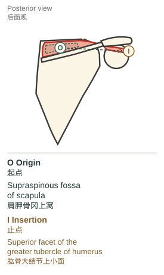

**Origin（起点）:** [Supraspinous fossa](http://127.0.0.1:5178/?term=supraspinous-fossa) of the [scapula](http://127.0.0.1:5178/?term=scapula)  
肩胛骨冈上窝

**Insertion（止点）:** Superior facet of the [greater tubercle](http://127.0.0.1:5178/?term=greater-tubercle) of the [humerus](http://127.0.0.1:5178/?term=humerus)  
肱骨大结节上小面

The [supraspinatus](http://127.0.0.1:5178/?term=supraspinatus) originates from the [supraspinous fossa](http://127.0.0.1:5178/?term=supraspinous-fossa) of the [scapula](http://127.0.0.1:5178/?term=scapula). Its tendon passes laterally beneath the [acromion](http://127.0.0.1:5178/?term=acromion) and inserts onto the superior facet of the [greater tubercle](http://127.0.0.1:5178/?term=greater-tubercle) of the [humerus](http://127.0.0.1:5178/?term=humerus).

冈上肌起自肩胛骨冈上窝。其肌腱向外侧走行，从肩峰下方经过，止于肱骨大结节上小面。

It contributes to shoulder abduction and helps stabilize the [humeral head](http://127.0.0.1:5178/?term=humeral-head) in the glenoid cavity.

它参与肩关节外展，并帮助将肱骨头稳定在关节盂内。

[Explore in 3D · 三维查看](http://127.0.0.1:5178/?term=supraspinatus) · [Anatomy source · 解剖依据](https://www.elsevier.com/resources/anatomy/muscular-system/muscles-of-upper-limb/supraspinatus-muscle/21166)

### [Infraspinatus](http://127.0.0.1:5178/?term=infraspinatus)｜冈下肌

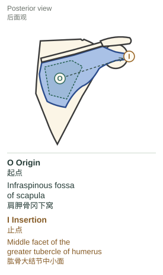

**Origin（起点）:** [Infraspinous fossa](http://127.0.0.1:5178/?term=infraspinous-fossa) of the [scapula](http://127.0.0.1:5178/?term=scapula)  
肩胛骨冈下窝

**Insertion（止点）:** Middle facet of the [greater tubercle](http://127.0.0.1:5178/?term=greater-tubercle) of the [humerus](http://127.0.0.1:5178/?term=humerus)  
肱骨大结节中小面

The [infraspinatus](http://127.0.0.1:5178/?term=infraspinatus) originates from the [infraspinous fossa](http://127.0.0.1:5178/?term=infraspinous-fossa) of the [scapula](http://127.0.0.1:5178/?term=scapula). Its fibers converge laterally into a tendon that passes behind the glenohumeral joint and inserts onto the middle facet of the [greater tubercle](http://127.0.0.1:5178/?term=greater-tubercle) of the [humerus](http://127.0.0.1:5178/?term=humerus).

冈下肌起自肩胛骨冈下窝。肌纤维向外侧汇聚成肌腱，经盂肱关节后方走行，止于肱骨大结节中小面。

It externally rotates the [humerus](http://127.0.0.1:5178/?term=humerus) and contributes to dynamic stability of the glenohumeral joint.

它使肱骨外旋，并参与盂肱关节的动态稳定。

[Explore in 3D · 三维查看](http://127.0.0.1:5178/?term=infraspinatus) · [Anatomy source · 解剖依据](https://elsevier-elibrary.com/contents/fullcontent/58750/epubcontent_v2/OEBPS/B9780443066849500548.htm)

### [Teres minor](http://127.0.0.1:5178/?term=teres-minor)｜小圆肌

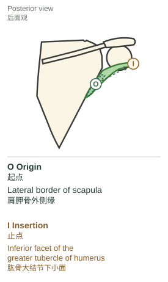

**Origin（起点）:** Upper part of the lateral border of the [scapula](http://127.0.0.1:5178/?term=scapula)  
肩胛骨外侧缘上部

**Insertion（止点）:** Inferior facet of the [greater tubercle](http://127.0.0.1:5178/?term=greater-tubercle) of the [humerus](http://127.0.0.1:5178/?term=humerus)  
肱骨大结节下小面

The [teres minor](http://127.0.0.1:5178/?term=teres-minor) originates from the upper part of the lateral border of the [scapula](http://127.0.0.1:5178/?term=scapula). It runs superolaterally along the inferior border of the [infraspinatus](http://127.0.0.1:5178/?term=infraspinatus) and inserts onto the inferior facet of the [greater tubercle](http://127.0.0.1:5178/?term=greater-tubercle) of the [humerus](http://127.0.0.1:5178/?term=humerus).

小圆肌起自肩胛骨外侧缘上部。它沿冈下肌下缘向上外侧走行，止于肱骨大结节下小面。

It assists external rotation of the [humerus](http://127.0.0.1:5178/?term=humerus) and helps stabilize the [humeral head](http://127.0.0.1:5178/?term=humeral-head). Teres major is a separate muscle and is not part of the [rotator cuff](http://127.0.0.1:5178/?term=rotator-cuff).

它协助肱骨外旋并帮助稳定肱骨头。大圆肌是另一块肌肉，不属于肩袖。

[Explore in 3D · 三维查看](http://127.0.0.1:5178/?term=teres-minor) · [Anatomy source · 解剖依据](https://elsevier-elibrary.com/contents/fullcontent/58750/epubcontent_v2/OEBPS/B9780443066849500548.htm)

### [Subscapularis](http://127.0.0.1:5178/?term=subscapularis)｜肩胛下肌

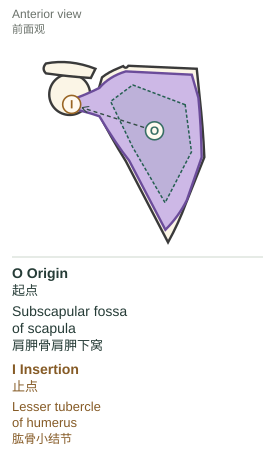

**Origin（起点）:** Subscapular fossa on the anterior surface of the [scapula](http://127.0.0.1:5178/?term=scapula)  
肩胛骨前面的肩胛下窝

**Insertion（止点）:** [Lesser tubercle](http://127.0.0.1:5178/?term=lesser-tubercle) of the [humerus](http://127.0.0.1:5178/?term=humerus)  
肱骨小结节

The [subscapularis](http://127.0.0.1:5178/?term=subscapularis) originates from the subscapular fossa on the anterior surface of the [scapula](http://127.0.0.1:5178/?term=scapula). It passes laterally in front of the glenohumeral joint and inserts onto the [lesser tubercle](http://127.0.0.1:5178/?term=lesser-tubercle) of the [humerus](http://127.0.0.1:5178/?term=humerus).

肩胛下肌起自肩胛骨前面的肩胛下窝。它经盂肱关节前方向外侧走行，止于肱骨小结节。

It internally rotates the [humerus](http://127.0.0.1:5178/?term=humerus) and contributes to anterior stability of the glenohumeral joint.

它使肱骨内旋，并参与盂肱关节前方的稳定。

[Explore in 3D · 三维查看](http://127.0.0.1:5178/?term=subscapularis) · [Anatomy source · 解剖依据](https://www.elsevier.com/resources/anatomy/muscular-system/muscles-of-upper-limb/subscapularis-muscle/16597)

### Describing a muscle in English｜用英语完整描述肌肉

The [muscle] originates from [origin], passes [direction / relation], and inserts onto [insertion].

［肌肉］起自［起点］，沿［方向／相邻关系］走行，止于［止点］。

The [supraspinatus](http://127.0.0.1:5178/?term=supraspinatus) tendon passes beneath the [acromion](http://127.0.0.1:5178/?term=acromion). [Teres minor](http://127.0.0.1:5178/?term=teres-minor) runs along the inferior border of the [infraspinatus](http://127.0.0.1:5178/?term=infraspinatus).

冈上肌腱从肩峰下方经过。小圆肌沿冈下肌下缘走行。

It is innervated by [nerve] and contributes to [movement / stability].

它由［神经］支配，并参与［动作／稳定］。

## 02 Innervation and anatomical nerve course｜神经支配与解剖走行

C stands for cervical (neck), whereas T stands for thoracic (chest). In an innervation label such as C5–C6, the numbers identify the spinal nerve levels contributing fibers to the nerve; they do not identify two thoracic vertebrae. There are seven cervical vertebrae, C1–C7, but eight pairs of cervical spinal nerves, C1–C8. C1–C7 nerves leave above the same-numbered vertebra; C8 leaves between C7 and T1. The roots of the brachial plexus are the anterior rami of spinal nerves C5–T1, not the vertebral bones themselves.

C 是 cervical（颈部）的缩写，T 是 thoracic（胸部）的缩写。神经支配中的 C5–C6 指向该神经贡献纤维的脊神经节段，不是两块胸椎。颈椎有 7 块（C1–C7），颈神经有 8 对（C1–C8）；C1–C7 神经从同名椎骨上方穿出，C8 从 C7 与 T1 之间穿出。臂丛的“根”是 C5–T1 脊神经的前支，而不是椎骨本身。

- **C5 vertebra:** 第 5 颈椎，指骨。
- **C5 spinal nerve:** 第 5 颈神经，指神经。
- **T1 vertebra / T1 spinal nerve:** 第 1 胸椎 / 第 1 胸神经。

| Nerve｜神经 | Muscles supplied｜所支配肌肉 | Origin and nerve levels｜发出部位与节段 |
| --- | --- | --- |
| Suprascapular nerve 肩胛上神经 | [Supraspinatus](http://127.0.0.1:5178/?term=supraspinatus); [Infraspinatus](http://127.0.0.1:5178/?term=infraspinatus) 冈上肌；冈下肌 | Superior trunk of the brachial plexus, usually C5–C6 臂丛上干，通常为 C5–C6 |
| Axillary nerve 腋神经 | [Teres minor](http://127.0.0.1:5178/?term=teres-minor); [Deltoid](http://127.0.0.1:5178/?term=deltoid) 小圆肌；三角肌 | Posterior cord of the brachial plexus, mainly C5–C6 臂丛后束，主要为 C5–C6 |
| Upper and lower subscapular nerves 上、下肩胛下神经 | [Subscapularis](http://127.0.0.1:5178/?term=subscapularis); the lower nerve also supplies Teres major 肩胛下肌；下肩胛下神经还支配大圆肌 | Posterior cord of the brachial plexus, usually C5–C6 臂丛后束，通常为 C5–C6 |

### Suprascapular nerve: anatomical course｜肩胛上神经：解剖走行

Posterior view of the right shoulder. The suprascapular nerve passes beneath the superior transverse scapular ligament, crosses the [supraspinous fossa](http://127.0.0.1:5178/?term=supraspinous-fossa), turns around the spinoglenoid notch, and enters the [infraspinous fossa](http://127.0.0.1:5178/?term=infraspinous-fossa). Muscles are translucent to expose the deep nerve course.

右肩后面观。肩胛上神经从肩胛上横韧带下方穿过，横过冈上窝，绕过冈盂切迹，进入冈下窝。肌肉半透明显示，以显露深面的神经走行。

The suprascapular nerve arises from the superior trunk of the brachial plexus, usually carrying fibers from C5 and C6. It courses posterolaterally across the posterior triangle of the neck and passes through the suprascapular notch beneath the superior transverse scapular ligament. It gives motor branches to [Supraspinatus](http://127.0.0.1:5178/?term=supraspinatus) in the [supraspinous fossa](http://127.0.0.1:5178/?term=supraspinous-fossa), then passes around the lateral end of the [scapular spine](http://127.0.0.1:5178/?term=scapular-spine) through the spinoglenoid notch to supply [Infraspinatus](http://127.0.0.1:5178/?term=infraspinatus) in the [infraspinous fossa](http://127.0.0.1:5178/?term=infraspinous-fossa).

肩胛上神经起自臂丛上干，通常含 C5、C6 神经纤维。它向后外侧经过颈后三角，从肩胛上横韧带下方穿过肩胛上切迹，在冈上窝内发出支配冈上肌的运动支；随后绕过肩胛冈外侧端，经冈盂切迹进入冈下窝，支配冈下肌。

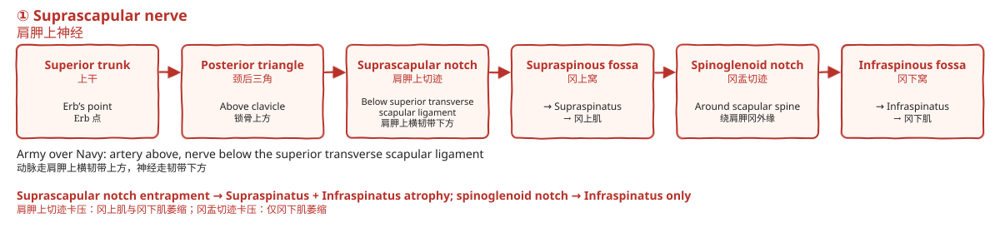

A compact route map to accompany the anatomy drawing.

与解剖图配套的简明走行图。

### Axillary nerve: the quadrangular space｜腋神经：四边孔

Posterior view with [Deltoid](http://127.0.0.1:5178/?term=deltoid) removed. The quadrangular space is bounded by [Teres minor](http://127.0.0.1:5178/?term=teres-minor) superiorly, Teres major inferiorly, the long head of Triceps brachii medially, and the [surgical neck](http://127.0.0.1:5178/?term=surgical-neck) of the [Humerus](http://127.0.0.1:5178/?term=humerus) laterally. The axillary nerve and posterior circumflex humeral artery pass through it.

移除三角肌后的后面观。四边孔的上界为小圆肌，下界为大圆肌，内界为肱三头肌长头，外界为肱骨外科颈。腋神经与旋肱后动脉经此穿过。

The axillary nerve arises from the posterior cord of the brachial plexus, mainly from C5 and C6. It passes posteriorly through the quadrangular space with the posterior circumflex humeral artery and winds around the [surgical neck](http://127.0.0.1:5178/?term=surgical-neck) of the [Humerus](http://127.0.0.1:5178/?term=humerus) deep to [Deltoid](http://127.0.0.1:5178/?term=deltoid). Its anterior branch supplies the anterior and middle parts of [Deltoid](http://127.0.0.1:5178/?term=deltoid). Its posterior branch supplies [Teres minor](http://127.0.0.1:5178/?term=teres-minor) and the posterior part of [Deltoid](http://127.0.0.1:5178/?term=deltoid) and continues as the superior lateral cutaneous nerve of the arm.

腋神经起自臂丛后束，主要含 C5、C6 神经纤维。它与旋肱后动脉一起向后穿过四边孔，在三角肌深面绕行肱骨外科颈。前支支配三角肌前部和中部；后支支配小圆肌及三角肌后部，并延续为臂外上侧皮神经。

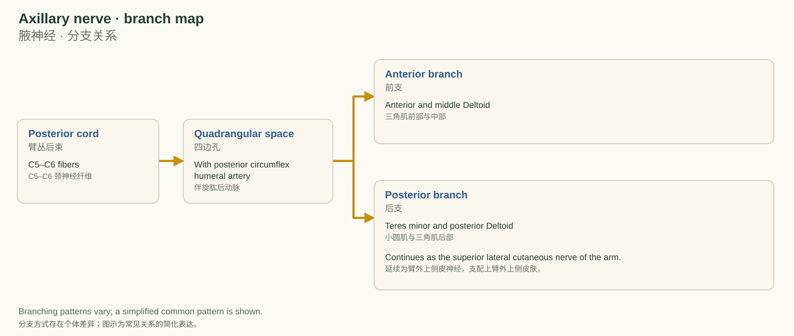

A compact route map to accompany the anatomy drawing.

与解剖图配套的简明走行图。

### Brachial plexus: from roots to peripheral nerves｜臂丛：从根到周围神经

The anterior rami of C5 and C6 unite to form the superior trunk. Each trunk divides into anterior and posterior divisions. The posterior divisions contribute to the posterior cord, from which the axillary and subscapular nerves arise. The suprascapular nerve branches earlier, directly from the superior trunk.

C5、C6 脊神经的前支合成上干。各干再分为前股和后股；后股共同组成后束，腋神经和肩胛下神经从后束发出。肩胛上神经更早分出，直接起自上干。

Vertebrae, spinal nerve levels, and branches of the brachial plexus are labeled separately.

椎骨、脊神经节段及臂丛分支分别标注。

Roots → Trunks → Divisions → Cords → Branches. “Randy Travis Drinks Cold Beer” is a mnemonic for this sequence.

根 → 干 → 股 → 束 → 支。“Randy Travis Drinks Cold Beer” 用来记忆这个顺序。

Anatomy references · 解剖依据：[University of Utah, Shoulder, Axilla and Arm / upper-limb anatomy syllabus](https://anatomy.med.utah.edu/diganat/PT/2014_lecture/PT_syllabus_2014_sm.pdf) · [University of Utah, Unit 4 Limbs syllabus](https://anatomy.med.utah.edu/diganat/SOM/unit_4/lec/unit4%20dm.vb.indd.pdf) · [NCBI Bookshelf: Anatomy, Head and Neck, Cervical Nerves](https://www.ncbi.nlm.nih.gov/books/NBK538136/) · [NCBI Bookshelf: Anatomy, Head and Neck, Cervical Vertebrae](https://www.ncbi.nlm.nih.gov/books/NBK539734/)

## 03 Movement: attachments, force couples, and scapulohumeral rhythm｜动作配合：起止点、力偶与肩肱节律

### 3.1 From attachment to action｜3.1 从起止点理解动作

[Supraspinatus](http://127.0.0.1:5178/?term=supraspinatus) runs from the [supraspinous fossa](http://127.0.0.1:5178/?term=supraspinous-fossa) to the superior facet of the [greater tubercle](http://127.0.0.1:5178/?term=greater-tubercle). Its line of action contributes to shoulder abduction. [Infraspinatus](http://127.0.0.1:5178/?term=infraspinatus) and [teres minor](http://127.0.0.1:5178/?term=teres-minor) pass behind the glenohumeral joint to the middle and inferior facets of the [greater tubercle](http://127.0.0.1:5178/?term=greater-tubercle), respectively; both contribute to external rotation. [Subscapularis](http://127.0.0.1:5178/?term=subscapularis) passes in front of the joint from the subscapular fossa to the [lesser tubercle](http://127.0.0.1:5178/?term=lesser-tubercle) and contributes to internal rotation.

冈上肌从冈上窝走向大结节上小面，其作用线参与肩关节外展。冈下肌和小圆肌经盂肱关节后方，分别止于大结节中、下小面，两者均参与外旋。肩胛下肌从肩胛下窝经关节前方走向小结节，参与内旋。

All four muscles also contribute to glenohumeral stability. A muscle’s attachment line helps explain its action, but the resulting movement also depends on joint position and the activity of other muscles.

四块肌肉也都参与盂肱关节稳定。起止点的连线有助于解释肌肉作用，但实际运动还取决于关节位置及其他肌肉的活动。

Solid arrows show muscle pull; the separate O → I panel lists attachments.

实线箭头表示肌肉拉力；独立的 O → I 面板列出起止点。

### 3.2 Two force couples｜3.2 两组力偶

At the glenohumeral joint, the [deltoid](http://127.0.0.1:5178/?term=deltoid) and [rotator cuff](http://127.0.0.1:5178/?term=rotator-cuff) work together to elevate the arm while controlling the position of the [humeral head](http://127.0.0.1:5178/?term=humeral-head). At the [scapula](http://127.0.0.1:5178/?term=scapula), the upper and lower trapezius work with serratus anterior to produce upward rotation during arm elevation.

在盂肱关节，三角肌与肩袖协同抬臂，并控制肱骨头的位置。在肩胛骨，上、下斜方肌与前锯肌协作，在上举过程中产生肩胛骨上旋。

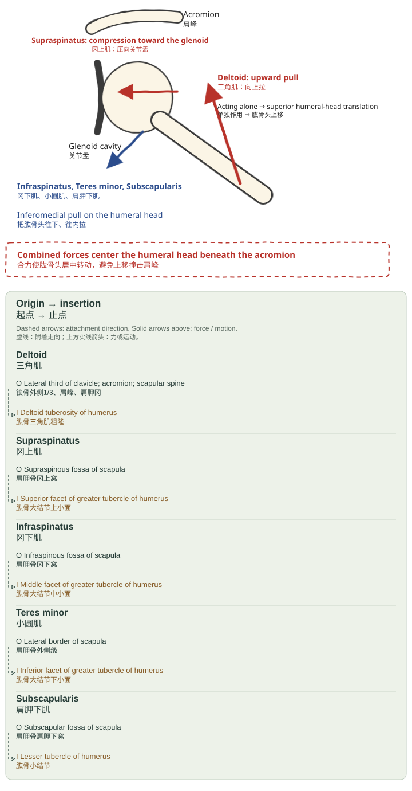

Glenohumeral force couple: [deltoid](http://127.0.0.1:5178/?term=deltoid) and [rotator cuff](http://127.0.0.1:5178/?term=rotator-cuff), with an attachment reference panel.

盂肱关节力偶：三角肌与肩袖；下方附起止点对照。

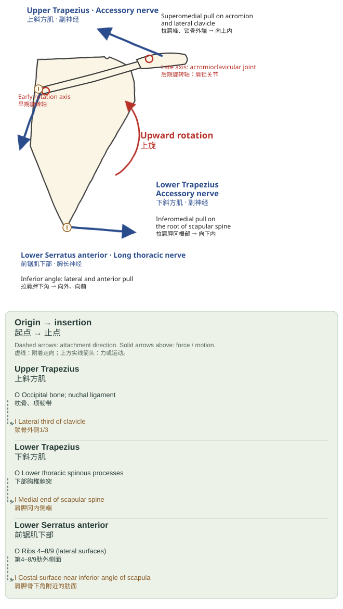

Scapular upward rotation: trapezius and serratus anterior. Visible insertion regions are marked I.

肩胛骨上旋：斜方肌与前锯肌。图中显示的止点区域用 I 标记。

### Attachments of the muscles that move the [scapula](http://127.0.0.1:5178/?term=scapula) and [humerus](http://127.0.0.1:5178/?term=humerus)｜带动肩胛骨与肱骨的肌肉起止点

#### [Deltoid](http://127.0.0.1:5178/?term=deltoid)｜三角肌

The [deltoid](http://127.0.0.1:5178/?term=deltoid) originates from the lateral third of the [clavicle](http://127.0.0.1:5178/?term=clavicle), the [acromion](http://127.0.0.1:5178/?term=acromion), and the spine of the [scapula](http://127.0.0.1:5178/?term=scapula). Its fibers converge onto the deltoid tuberosity of the [humerus](http://127.0.0.1:5178/?term=humerus). The middle, or acromial, part contributes strongly to arm abduction.

三角肌起自锁骨外侧三分之一、肩峰和肩胛冈，肌纤维汇聚止于肱骨三角肌粗隆。其中部，即肩峰部，是手臂外展的重要参与者。

[Explore in 3D · 三维查看](http://127.0.0.1:5178/?term=deltoid)

#### Upper trapezius｜上斜方肌

The upper fibers of trapezius extend from the occipital region and nuchal ligament toward the lateral third of the [clavicle](http://127.0.0.1:5178/?term=clavicle). They act with the other scapular rotators during elevation of the arm.

斜方肌上部纤维从枕部和项韧带延伸到锁骨外侧三分之一，并在手臂上举时与其他肩胛旋转肌协作。

3D mesh not included in the current atlas. Its origin and insertion are shown in this section’s diagrams.

当前模型包未包含这块肌肉，起止点见本节图示。

#### Lower trapezius｜下斜方肌

The lower fibers of trapezius arise from the spinous processes of the lower thoracic vertebrae, commonly described as T4–T12, and insert near the medial end of the [scapular spine](http://127.0.0.1:5178/?term=scapular-spine). Here T denotes thoracic vertebrae.

斜方肌下部纤维起自下部胸椎棘突，常描述为 T4–T12，止于肩胛冈内侧端附近。这里的 T 表示胸椎。

3D mesh not included in the current atlas. Its origin and insertion are shown in this section’s diagrams.

当前模型包未包含这块肌肉，起止点见本节图示。

#### Serratus anterior｜前锯肌

Serratus anterior originates from the lateral surfaces of the upper eight or nine ribs. It passes around the thoracic wall and inserts onto the anterior, or costal, surface of the medial border of the [scapula](http://127.0.0.1:5178/?term=scapula). Its inferior fibers attach near the [inferior angle](http://127.0.0.1:5178/?term=inferior-angle) and contribute to upward rotation.

前锯肌起自上八或九根肋骨的外侧面，绕过胸壁，止于肩胛骨内侧缘的前面（肋面）。其下部纤维附着于下角附近，参与肩胛骨上旋。

3D mesh not included in the current atlas. Its origin and insertion are shown in this section’s diagrams.

当前模型包未包含这块肌肉，起止点见本节图示。

### 3.3 Arm elevation and scapulohumeral rhythm｜3.3 手臂上举与肩肱节律

Arm elevation combines glenohumeral motion with scapulothoracic motion. The familiar 2:1 ratio is a teaching approximation, not a fixed ratio at every angle. Scapular motion varies with the task, the plane of elevation, and the individual.

手臂上举结合了盂肱关节活动和肩胛胸壁活动。常见的 2∶1 是教学概括，并不是每个角度都恒定不变的比例。肩胛骨运动会随任务、上举平面与个体而变化。

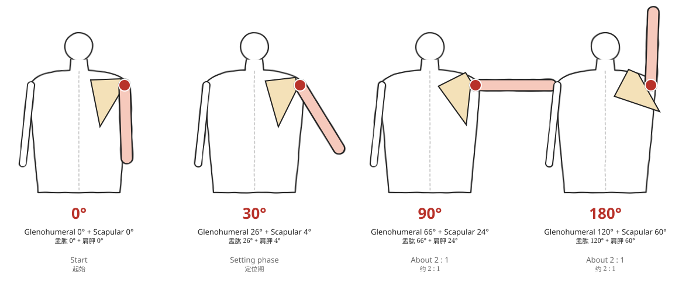

A schematic of arm elevation from 0° to 180°.

0° 至 180° 手臂上举示意。

#### 0–30° · Initiation and positioning｜起动与定位

[Supraspinatus](http://127.0.0.1:5178/?term=supraspinatus) and [deltoid](http://127.0.0.1:5178/?term=deltoid) contribute to initiation of elevation. The [rotator cuff](http://127.0.0.1:5178/?term=rotator-cuff) helps stabilize the [humeral head](http://127.0.0.1:5178/?term=humeral-head), while the scapular muscles position the [scapula](http://127.0.0.1:5178/?term=scapula).

冈上肌与三角肌参与上举起动；肩袖帮助稳定肱骨头，肩胛肌群调节肩胛骨位置。

#### 30–90° · Coordinated upward rotation｜协同上旋

Glenohumeral and scapular motion occur together. Trapezius and serratus anterior contribute to scapular upward rotation, and the [clavicle](http://127.0.0.1:5178/?term=clavicle) also moves.

盂肱关节与肩胛骨活动相互配合；斜方肌与前锯肌参与肩胛骨上旋，锁骨也同时运动。

#### 90–180° · Continued rotation and clearance｜持续旋转与空间配合

Further elevation involves continued scapular upward rotation and posterior tilt, together with humeral external rotation and clavicular motion. These are overlapping contributions rather than isolated on-off stages.

继续上举涉及肩胛骨持续上旋、后倾，以及肱骨外旋和锁骨运动。这些作用相互重叠，并不是彼此孤立、依次开关的阶段。

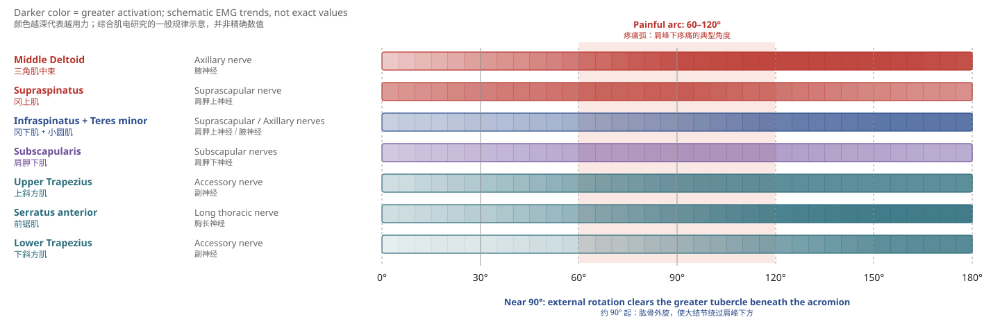

Schematic activation trends, not exact EMG values.

一般性肌肉参与趋势示意，不是精确肌电数值。

Anatomy references · 解剖依据：[Deltoid anatomy](https://www.elsevier.com/resources/anatomy/muscular-system/muscles-of-upper-limb-left/deltoid-muscle-left/19926) · [Trapezius anatomy](https://elsevier-elibrary.com/contents/fullcontent/58600/epubcontent_v2/OEBPS/B9780702043550000051.htm) · [Serratus anterior anatomy](https://www.ncbi.nlm.nih.gov/books/NBK531457/)

## 04 Clinical tests and surface anatomy｜临床检查与体表解剖

### 4.1 [Rotator cuff](http://127.0.0.1:5178/?term=rotator-cuff) muscles and special tests｜4.1 [Rotator cuff](http://127.0.0.1:5178/?term=rotator-cuff) muscles（肩袖肌肉） 与特殊检查

| 对应肌肉 | 特殊检查 | 相关动作与结构 |
| --- | --- | --- |
| [Supraspinatus](http://127.0.0.1:5178/?term=supraspinatus)（冈上肌） | Empty can test（空罐试验） / Drop arm test（落臂试验） | Abduction（外展）；Subacromial（肩峰下） 的肌腱位置 |
| [Infraspinatus](http://127.0.0.1:5178/?term=infraspinatus)（冈下肌） | Resisted external rotation（抗阻外旋） / External rotation lag sign（外旋滞后征） | External rotation（外旋）；Suprascapular nerve（肩胛上神经） |
| [Teres minor](http://127.0.0.1:5178/?term=teres-minor)（小圆肌） | Hornblower sign（Hornblower 征） | External rotation（外旋）；Axillary nerve（腋神经） |
| [Subscapularis](http://127.0.0.1:5178/?term=subscapularis)（肩胛下肌） | Lift-off test（抬离试验） / Belly-press test（腹压试验） | Internal rotation（内旋）；Anterior surface of the [scapula](http://127.0.0.1:5178/?term=scapula)（肩胛骨前面） 与 [Lesser tubercle](http://127.0.0.1:5178/?term=lesser-tubercle)（小结节） |

#### Common injuries and involved structures｜常见损伤与累及结构

- [Supraspinatus](http://127.0.0.1:5178/?term=supraspinatus) tendon（冈上肌腱）：Subacromial impingement（肩峰下撞击）、撕裂最常见
- Suprascapular notch（肩胛上切迹） 卡压 → [Supraspinatus](http://127.0.0.1:5178/?term=supraspinatus)（冈上肌） + [Infraspinatus](http://127.0.0.1:5178/?term=infraspinatus)（冈下肌） 萎缩
- Spinoglenoid notch（冈盂切迹） 卡压 → 只有 [Infraspinatus](http://127.0.0.1:5178/?term=infraspinatus)（冈下肌） 萎缩
- Shoulder joint（肩关节） 前脱位 → Axillary nerve（腋神经）、[Subscapularis](http://127.0.0.1:5178/?term=subscapularis)（肩胛下肌）

#### Muscle imbalance and movement findings｜肌肉失衡与动作表现

- Serratus anterior（前锯肌） 无力：Scapular upward rotation（肩胛上旋） 不足、Scapular winging（翼状肩胛） 与 Arm elevation（上举） 困难。
- Upper trapezius（上斜方肌） 过度、Lower trapezius（下斜方肌） 弱：耸肩代偿。
- [Rotator cuff](http://127.0.0.1:5178/?term=rotator-cuff)（肩袖） 无力：[Deltoid](http://127.0.0.1:5178/?term=deltoid)（三角肌）—[Rotator cuff](http://127.0.0.1:5178/?term=rotator-cuff)（肩袖） Force couple（力偶）、[Humeral head](http://127.0.0.1:5178/?term=humeral-head)（肱骨头） 上移、Subacromial space（肩峰下间隙） 与疼痛。

### 4.2 Nerve injury: sensory and motor findings｜4.2 神经损伤与感觉、运动表现

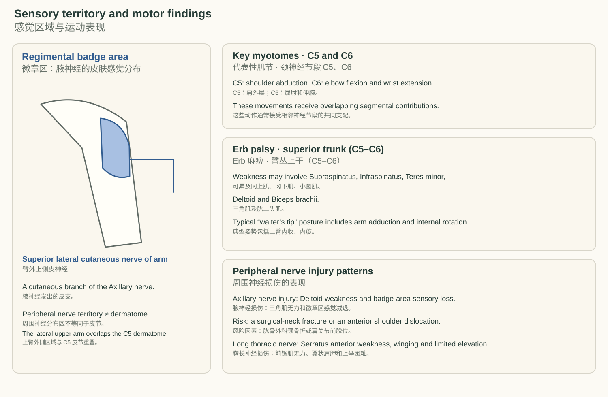

*Axillary nerve（腋神经） 的感觉区域、Myotome（肌节） 与损伤部位。*

### 4.3 Acupoints and regional anatomy｜4.3 穴位与局部解剖

*红点为穴位，金色线为神经走行；视角与第 01 节解剖图一致。*

#### 穴位与肌肉对应表 · 9 个条目

定位依据：GB/T 12346《腧穴名称与定位》。层次写的是从浅到深会经过的肌肉。干针找的是“Trigger point（触发点）”，不按经络取穴，但两者的位置常常重合。

| 穴位 | 定位 | 层次：浅 → 深 | Trigger point（触发点） / 目标 | 安全提示 |
| --- | --- | --- | --- | --- |
| Tianzong SI11（天宗） | [Scapular spine](http://127.0.0.1:5178/?term=scapular-spine)（肩胛冈） 中点与 [Inferior angle](http://127.0.0.1:5178/?term=inferior-angle) of the [scapula](http://127.0.0.1:5178/?term=scapula)（肩胛下角） 连线上 1/3 与下 2/3交点凹陷中 | [Infraspinatus](http://127.0.0.1:5178/?term=infraspinatus)（冈下肌） | [Infraspinatus](http://127.0.0.1:5178/?term=infraspinatus)（冈下肌） Trigger point（触发点） → 牵涉到肩前深部 | 深面是骨面，较安全 |
| Bingfeng SI12（秉风） | [Scapular spine](http://127.0.0.1:5178/?term=scapular-spine)（肩胛冈） 中点上方，[Supraspinous fossa](http://127.0.0.1:5178/?term=supraspinous-fossa)（冈上窝） 中 | Trapezius（斜方肌） → [Supraspinatus](http://127.0.0.1:5178/?term=supraspinatus)（冈上肌） | [Supraspinatus](http://127.0.0.1:5178/?term=supraspinatus)（冈上肌） Trigger point（触发点） → 牵涉到 [Deltoid](http://127.0.0.1:5178/?term=deltoid)（三角肌） 外侧 | 深面有 Suprascapular nerve（肩胛上神经）、血管 |
| Quyuan SI13（曲垣） | Medial end of the [scapular spine](http://127.0.0.1:5178/?term=scapular-spine)（肩胛冈内侧端） 上缘凹陷中 | Trapezius（斜方肌） → [Supraspinatus](http://127.0.0.1:5178/?term=supraspinatus)（冈上肌）（内侧） | [Supraspinatus](http://127.0.0.1:5178/?term=supraspinatus)（冈上肌） 内侧 | 勿向内下深刺 |
| Jugu LI16（巨骨） | Acromial end of the [clavicle](http://127.0.0.1:5178/?term=clavicle)（锁骨肩峰端） 与 [Scapular spine](http://127.0.0.1:5178/?term=scapular-spine)（肩胛冈） 之间凹陷中 | Trapezius（斜方肌） → [Supraspinatus](http://127.0.0.1:5178/?term=supraspinatus)（冈上肌） | [Supraspinatus](http://127.0.0.1:5178/?term=supraspinatus)（冈上肌）（上方入路） | 宜斜刺，勿深刺 |
| Naoshu SI10（臑俞） | Superior end of the posterior axillary fold（腋后纹头） 直上，[Scapular spine](http://127.0.0.1:5178/?term=scapular-spine)（肩胛冈） 下缘凹陷中 | [Posterior deltoid](http://127.0.0.1:5178/?term=posterior-deltoid)（三角肌后部） → [Infraspinatus](http://127.0.0.1:5178/?term=infraspinatus)（冈下肌） | [Infraspinatus](http://127.0.0.1:5178/?term=infraspinatus)（冈下肌） 外侧、[Posterior deltoid](http://127.0.0.1:5178/?term=posterior-deltoid)（三角肌后束） | — |
| Jianzhen SI9（肩贞） | Shoulder joint（肩关节） 后下方，Superior end of the posterior axillary fold（腋后纹头） 直上 1 寸 | Posterior border of the [deltoid](http://127.0.0.1:5178/?term=deltoid)（三角肌后缘） → [Teres minor](http://127.0.0.1:5178/?term=teres-minor)（小圆肌）、Teres major（大圆肌） | [Teres minor](http://127.0.0.1:5178/?term=teres-minor)（小圆肌） Trigger point（触发点） | 深面 Quadrangular space（四边孔）：Axillary nerve（腋神经）、Posterior circumflex humeral artery（旋肱后动脉） |
| Jianliao TE14（肩髎） | Acromial angle（肩峰角） 与 [Greater tubercle](http://127.0.0.1:5178/?term=greater-tubercle) of the [humerus](http://127.0.0.1:5178/?term=humerus)（肱骨大结节） 两骨间凹陷中 | [Deltoid](http://127.0.0.1:5178/?term=deltoid)（三角肌） → [Infraspinatus](http://127.0.0.1:5178/?term=infraspinatus)（冈下肌）、[Teres minor](http://127.0.0.1:5178/?term=teres-minor) tendon（小圆肌腱） 附近 | [Posterior deltoid](http://127.0.0.1:5178/?term=posterior-deltoid)（三角肌后束） | — |
| Jianyu LI15（肩髃） | Lateral border of the [acromion](http://127.0.0.1:5178/?term=acromion)（肩峰外侧缘） 前端与 [Greater tubercle](http://127.0.0.1:5178/?term=greater-tubercle) of the [humerus](http://127.0.0.1:5178/?term=humerus)（肱骨大结节） 两骨间凹陷中 | [Deltoid](http://127.0.0.1:5178/?term=deltoid)（三角肌） → [Supraspinatus](http://127.0.0.1:5178/?term=supraspinatus) tendon（冈上肌腱）、Subacromial bursa（肩峰下滑囊） | Anterior and [middle deltoid](http://127.0.0.1:5178/?term=acromial-part)（三角肌前、中束）；最贴近 Subacromial pain（肩峰下疼痛） 部位 | — |
| Jiquan HT1（极泉） | Axilla（腋窝） 中央，Axillary artery（腋动脉） 搏动处 | Axilla（腋窝） 脂肪 → 深面近 [Subscapularis](http://127.0.0.1:5178/?term=subscapularis)（肩胛下肌） | [Subscapularis](http://127.0.0.1:5178/?term=subscapularis)（肩胛下肌）（Axillary approach（腋窝入路）） | Axillary artery（腋动脉）、Brachial plexus（臂丛）；需专门训练 |

#### 颈部、Supraclavicular region（锁骨上区） 与 Scapular upward rotation（肩胛上旋） 肌群的穴位对照

| 区域 / 穴位 | 定位与对应 | 相关结构与风险 |
| --- | --- | --- |
| Cervical Jiaji（颈夹脊）（C5–C6） | C5、C6 Spinous process（棘突） 下旁开 0.5 寸 | 深面靠近 C5/C6 Nerve root（神经根） 出口 |
| Quepen ST12（缺盆） | Supraclavicular fossa（锁骨上窝） 中央，前正中线旁开 4 寸 | 深面有 Superior and middle trunks of the brachial plexus（臂丛上中干）、Subclavian artery（锁骨下动脉）、Apex of the lung（肺尖）；禁深刺 |
| Jianjing GB21（肩井） | 对应 Upper trapezius（上斜方肌） | 深面 Apex of the lung（肺尖），禁深刺 |
| Zhejin GB23（辄筋） | 对应 Serratus anterior（前锯肌） | 深面 Pleura（胸膜），宜平刺 |

#### Bony landmarks（骨性标志） 与 [Rotator cuff](http://127.0.0.1:5178/?term=rotator-cuff)（肩袖） 触诊

1. **找 [Scapular spine](http://127.0.0.1:5178/?term=scapular-spine)（肩胛冈）** 从 [Acromion](http://127.0.0.1:5178/?term=acromion)（肩峰） 往内侧摸，摸到一条横的骨嵴，一直摸到 Medial border of the [scapula](http://127.0.0.1:5178/?term=scapula)（肩胛骨内侧缘）
2. **[Supraspinatus](http://127.0.0.1:5178/?term=supraspinatus)（冈上肌） · Bingfeng（秉风）** [Scapular spine](http://127.0.0.1:5178/?term=scapular-spine)（肩胛冈） 中点上方的窝里按下去；让他手臂抗阻 Abduction（外展） 15°，能摸到收紧
3. **[Infraspinatus](http://127.0.0.1:5178/?term=infraspinatus)（冈下肌） · Tianzong（天宗）** [Infraspinous fossa](http://127.0.0.1:5178/?term=infraspinous-fossa)（冈下窝） 中央；Elbow flexion（屈肘） 90° Resisted external rotation（抗阻外旋），整片肌肉鼓起来
4. **[Teres minor](http://127.0.0.1:5178/?term=teres-minor)（小圆肌） · Jianzhen（肩贞）** Superior end of the posterior axillary fold（腋后纹头） 上方、Lateral border of the [scapula](http://127.0.0.1:5178/?term=scapula)（肩胛骨外侧缘）；同样 Resisted external rotation（抗阻外旋） 时收缩，紧贴 [Infraspinatus](http://127.0.0.1:5178/?term=infraspinatus)（冈下肌） 下缘
5. **[Subscapularis](http://127.0.0.1:5178/?term=subscapularis)（肩胛下肌） · Jiquan（极泉） 方向** 仰卧，手臂稍 Abduction（外展），从 Axilla（腋窝） 后壁朝 Anterior surface of the [scapula](http://127.0.0.1:5178/?term=scapula)（肩胛骨前面） 按；让他抗阻 Internal rotation（内旋）

## 05 Review and recall · 整理与复习

### 5.1 Compact memory cues · 5.1 简记口诀

Three [rotator cuff](http://127.0.0.1:5178/?term=rotator-cuff) tendons attach to the [greater tubercle](http://127.0.0.1:5178/?term=greater-tubercle), and one attaches to the [lesser tubercle](http://127.0.0.1:5178/?term=lesser-tubercle).

三条肩袖肌腱附着于大结节，一条附着于小结节。

**中文口诀：** 三个坐大，一个站小。

[Supraspinatus](http://127.0.0.1:5178/?term=supraspinatus) and [infraspinatus](http://127.0.0.1:5178/?term=infraspinatus) share the suprascapular nerve; [teres minor](http://127.0.0.1:5178/?term=teres-minor) uses the axillary nerve, and [subscapularis](http://127.0.0.1:5178/?term=subscapularis) uses the subscapular nerves.

冈上肌与冈下肌同由肩胛上神经支配；小圆肌由腋神经支配，肩胛下肌由肩胛下神经支配。

**中文口诀：** 冈上冈下归肩上，小圆跟腋走，肩下找肩下。

The superior muscle assists abduction, the posterior muscles assist external rotation, and the anterior muscle assists internal rotation.

上方的肌肉协助外展，后方的肌肉协助外旋，前方的肌肉协助内旋。

**中文口诀：** 上面抬，后面外，前面内。

### 5.2 The same relationships in full sentences · 5.2 完整叙述：位置、支配与动作

#### Insertions · 止点

The tendons of [supraspinatus](http://127.0.0.1:5178/?term=supraspinatus), [infraspinatus](http://127.0.0.1:5178/?term=infraspinatus), and [teres minor](http://127.0.0.1:5178/?term=teres-minor) insert on the superior, middle, and inferior facets of the [greater tubercle](http://127.0.0.1:5178/?term=greater-tubercle) of the [humerus](http://127.0.0.1:5178/?term=humerus), respectively. The [subscapularis](http://127.0.0.1:5178/?term=subscapularis) tendon inserts on the [lesser tubercle](http://127.0.0.1:5178/?term=lesser-tubercle). These attachments connect the [rotator cuff](http://127.0.0.1:5178/?term=rotator-cuff) muscles to the proximal [humerus](http://127.0.0.1:5178/?term=humerus).

冈上肌、冈下肌和小圆肌的肌腱分别止于肱骨大结节的上面、中面和下面。肩胛下肌腱止于小结节。这些附着将肩袖肌肉连接到肱骨近端。

#### Innervation · 神经支配

The suprascapular nerve supplies [supraspinatus](http://127.0.0.1:5178/?term=supraspinatus) and [infraspinatus](http://127.0.0.1:5178/?term=infraspinatus). The axillary nerve supplies [teres minor](http://127.0.0.1:5178/?term=teres-minor) and also innervates the [deltoid](http://127.0.0.1:5178/?term=deltoid). The upper and lower subscapular nerves supply [subscapularis](http://127.0.0.1:5178/?term=subscapularis), and the lower subscapular nerve also supplies teres major.

肩胛上神经支配冈上肌和冈下肌。腋神经支配小圆肌，也支配三角肌。上、下肩胛下神经支配肩胛下肌，其中下肩胛下神经还支配大圆肌。

#### Actions and joint stability · 动作与关节稳定

[Supraspinatus](http://127.0.0.1:5178/?term=supraspinatus) assists shoulder abduction. [Infraspinatus](http://127.0.0.1:5178/?term=infraspinatus) and [teres minor](http://127.0.0.1:5178/?term=teres-minor) assist external rotation, whereas [subscapularis](http://127.0.0.1:5178/?term=subscapularis) assists internal rotation. The [rotator cuff](http://127.0.0.1:5178/?term=rotator-cuff) muscles also work together to stabilize the [humeral head](http://127.0.0.1:5178/?term=humeral-head) during shoulder movement; their roles extend beyond producing an isolated direction of movement.

冈上肌协助肩外展。冈下肌和小圆肌协助外旋，肩胛下肌协助内旋。肩袖肌肉还共同在肩部运动时稳定肱骨头，因此它们的作用不只是产生某一个单独方向的动作。

### 5.3 Questions and complete answers · 5.3 问题与完整答案

#### Which three [rotator cuff](http://127.0.0.1:5178/?term=rotator-cuff) muscles insert on the [greater tubercle](http://127.0.0.1:5178/?term=greater-tubercle), and which muscle inserts on the [lesser tubercle](http://127.0.0.1:5178/?term=lesser-tubercle)?

哪三块肩袖肌止于大结节，哪一块止于小结节？

**Answer · 答案**

[Supraspinatus](http://127.0.0.1:5178/?term=supraspinatus), [infraspinatus](http://127.0.0.1:5178/?term=infraspinatus), and [teres minor](http://127.0.0.1:5178/?term=teres-minor) insert on the superior, middle, and inferior facets of the [greater tubercle](http://127.0.0.1:5178/?term=greater-tubercle), respectively. [Subscapularis](http://127.0.0.1:5178/?term=subscapularis) inserts on the [lesser tubercle](http://127.0.0.1:5178/?term=lesser-tubercle). The order on the [greater tubercle](http://127.0.0.1:5178/?term=greater-tubercle) is therefore [supraspinatus](http://127.0.0.1:5178/?term=supraspinatus), [infraspinatus](http://127.0.0.1:5178/?term=infraspinatus), and [teres minor](http://127.0.0.1:5178/?term=teres-minor) from superior to inferior.

冈上肌、冈下肌和小圆肌分别止于大结节的上面、中面和下面。肩胛下肌止于小结节。因此，大结节上从上到下的顺序是冈上肌、冈下肌、小圆肌。

#### How does the innervation of [infraspinatus](http://127.0.0.1:5178/?term=infraspinatus) differ from that of [teres minor](http://127.0.0.1:5178/?term=teres-minor), even though both assist external rotation?

冈下肌与小圆肌都协助外旋，但二者的神经支配有什么不同？

**Answer · 答案**

[Infraspinatus](http://127.0.0.1:5178/?term=infraspinatus) is innervated by the suprascapular nerve, whereas [teres minor](http://127.0.0.1:5178/?term=teres-minor) is innervated by the axillary nerve. A shared action does not imply a shared peripheral nerve supply.

冈下肌由肩胛上神经支配，而小圆肌由腋神经支配。具有相同动作，并不意味着由同一条周围神经支配。

#### Why can suprascapular nerve compression at the suprascapular notch affect different muscles from compression at the spinoglenoid notch?

为什么肩胛上神经在肩胛上切迹与冈盂切迹受压时，可能累及不同的肌肉？

**Answer · 答案**

The suprascapular nerve passes through the suprascapular notch before supplying [supraspinatus](http://127.0.0.1:5178/?term=supraspinatus) and then continues toward [infraspinatus](http://127.0.0.1:5178/?term=infraspinatus) through the spinoglenoid notch. Compression at the suprascapular notch can therefore affect both muscles. Compression at the spinoglenoid notch occurs farther along the nerve and may affect [infraspinatus](http://127.0.0.1:5178/?term=infraspinatus) while sparing [supraspinatus](http://127.0.0.1:5178/?term=supraspinatus).

肩胛上神经先经过肩胛上切迹，再发出支配冈上肌的分支，随后经冈盂切迹继续走向冈下肌。因此，在肩胛上切迹受压可能累及这两块肌肉；在更远端的冈盂切迹受压，则可能累及冈下肌而保留冈上肌的功能。

#### During arm elevation, how do the [rotator cuff](http://127.0.0.1:5178/?term=rotator-cuff) muscles and the muscles that move the [scapula](http://127.0.0.1:5178/?term=scapula) contribute to shoulder function?

上举手臂时，肩袖肌群与带动肩胛骨的肌群分别怎样参与肩部功能？

**Answer · 答案**

The [rotator cuff](http://127.0.0.1:5178/?term=rotator-cuff) muscles help stabilize and rotate the [humeral head](http://127.0.0.1:5178/?term=humeral-head) at the glenohumeral joint. Serratus anterior and the upper and lower portions of trapezius coordinate scapular upward rotation as the arm elevates. Humeral motion and scapular motion therefore work together during elevation.

肩袖肌群帮助在盂肱关节处稳定并转动肱骨头。随着手臂上举，前锯肌与斜方肌的上部、下部协调肩胛骨上旋。因此，上举过程需要肱骨运动与肩胛骨运动相互配合。

### Spaced review · 间隔复习

On days 1, 3, 7, and 14, recall each muscle’s origin, insertion, innervation, and action before checking the answer. Connect the name to its location and nearby surface landmarks.

在第 1、3、7、14 天，先回忆每块肌肉的起点、止点、神经支配与动作，再核对答案。把名称与它的位置及附近的体表标志联系起来。

## 06 Paper reading: the additional effects of dry needling · 文章阅读：加用干针的额外获益

**[Dry Needling Plus Manual Therapy and Exercise for Subacromial Pain Syndrome: A Sham-Controlled Randomized Clinical Trial](https://doi.org/10.2519/jospt.2025.13460)**

干针联合手法治疗与运动治疗肩峰下疼痛综合征：一项假干针对照随机临床试验

Hando BR et al. · JOSPT 2026;56(1):50–63  
DOI: 10.2519/jospt.2025.13460

This appraisal uses the results abstract and the public study protocol. The full results article has not been obtained. A protocol records planned methods and cannot establish how the trial was actually conducted.

本节评价依据结果摘要与公开研究方案，尚未取得结果论文全文。研究方案记录的是计划采用的方法，不能据此确认试验实际怎样执行。

### 6.1 Research question and comparison groups · 6.1 研究问题与比较对象

In 121 participants with subacromial pain syndrome (SAPS), the trial compared physical therapy alone with physical therapy plus sham dry needling or dry needling. The primary outcome was the Shoulder Pain and Disability Index (SPADI) at 1 year.

试验纳入 121 名肩峰下疼痛综合征（SAPS）患者，比较单纯物理治疗、物理治疗加假干针，以及物理治疗加干针。主要结局是 1 年时的肩痛与功能障碍指数（SPADI）。

[Results abstract · 结果摘要](https://pubmed.ncbi.nlm.nih.gov/41476428/)

| Group / 组别 | Intervention / 干预 |
| --- | --- |
| PT | Manual therapy and exercise / 手法治疗与运动治疗 |
| PT + SDN | Physical therapy plus sham dry needling / 物理治疗加假干针 |
| PT + DN | Physical therapy plus dry needling / 物理治疗加干针 |

The PT comparison estimates the added effect of including dry needling in the treatment program. The sham comparison also accounts for aspects of receiving a needling procedure. These comparisons address different questions.

与 PT 组的比较估计在治疗方案中加入干针的额外效果；与假干针组的比较还考虑了接受针刺程序所涉及的部分因素。这两项比较回答的问题不同。

### 6.2 Primary outcome: SPADI at 1 year · 6.2 主要结局：1 年时的 SPADI

Lower SPADI scores indicate less pain and disability. A negative between-group difference favors PT + DN.

SPADI 分数越低，表示疼痛与功能障碍越轻。组间差值为负数时，方向上有利于 PT + DN 组。

| Comparison: PT + DN minus control / 比较：加用干针组减去对照组 | SPADI difference / SPADI 分差 | 95% confidence interval (CI) / 95% 置信区间 |
| --- | --- | --- |
| PT + DN vs PT | −7.51 | −16.57 to 1.54 |
| PT + DN vs PT + SDN | −9.85 | −18.98 to 0.73 |

Both confidence intervals include zero. The primary comparisons did not reach statistical significance; this does not establish equivalence or prove that dry needling has no effect. Estimates and intervals are reproduced as reported in the abstract.

两项置信区间都包含 0，主要比较未达到统计学显著性；这并不等于证明各组等效，也不等于证明干针没有作用。分差与区间按摘要所载记录，未自行修正。

[Reported SPADI estimates and intervals · 摘要报告的 SPADI 估计值与区间](https://pubmed.ncbi.nlm.nih.gov/41476428/)

### 6.3 Secondary outcomes: symptom acceptability and health care use · 6.3 次要结局：症状可接受状态与后续就医

The Patient Acceptable Symptom State (PASS) records whether participants consider their current symptoms acceptable. The differences below are absolute percentage-point differences in affirmative responses, not relative percentage improvements.

患者可接受症状状态（PASS）记录患者是否认为目前的症状可以接受。下表是回答“可以接受”的比例之绝对差值，单位为百分点，并非相对改善百分比。

| PASS comparison / PASS 比较 | Absolute difference / 绝对差值 | 95% CI / 95% 置信区间 |
| --- | --- | --- |
| 6 months: PT + DN vs PT / 6 个月：PT + DN 对比 PT | +34 percentage points / +34 个百分点 | +14 to +55 percentage points / +14 至 +55 个百分点 |
| 6 months: PT + DN vs PT + SDN / 6 个月：PT + DN 对比 PT + SDN | +24 percentage points / +24 个百分点 | +4 to +45 percentage points / +4 至 +45 个百分点 |
| 1 year: PT + DN vs PT + SDN / 1 年：PT + DN 对比 PT + SDN | +28 percentage points / +28 个百分点 | +7 to +49 percentage points / +7 至 +49 个百分点 |

For additional shoulder-related care within 1 year, the reported odds ratio (OR) was 0.35 (95% CI, 0.13–0.95). The abstract does not identify the reference group. An odds ratio cannot be directly restated as a risk reduction; this value should not be described as a 65% reduction in risk.

对于入组后 1 年内再次因肩部问题就医，摘要报告的优势比（OR）为 0.35（95% 置信区间 0.13–0.95）。摘要未说明参照组。优势比不能直接改写为风险降低的比例，因此不能把这个数值描述为“风险降低 65%”。

[PASS and health care use results · PASS 与后续就医结果](https://pubmed.ncbi.nlm.nih.gov/41476428/)

### 6.4 Methods appraisal and unresolved questions · 6.4 方法评价与尚未核实的信息

Randomization, a sham comparator, and a public protocol support a more transparent comparison. The appraisal below separates planned methods from verified conduct. It is not a complete risk-of-bias assessment.

随机分组、假干针对照以及公开研究方案，使比较过程更便于追溯。以下评价区分计划采用的方法与已经核实的执行情况，并不构成完整的偏倚风险评价。

#### Randomization and allocation concealment · 随机化与分配隐藏

Randomization determines group assignment; allocation concealment prevents advance knowledge of the next assignment during enrollment. The protocol planned sequentially numbered, opaque, sealed envelopes. Whether this procedure was implemented adequately remains unverified.

随机化用于确定分组；分配隐藏用于防止在入组过程中提前知道下一次分配结果。研究方案计划采用顺序编号、不透明且密封的信封。该程序是否得到充分落实，仍未核实。

[Protocol, p. 358: Randomization · 研究方案，第 358 页：随机化](https://www.rbf-bjpt.org.br/en-download-pdf-S1413355518307871)

#### Blinding and outcome measurement · 盲法与结局测量

The protocol planned to blind participants receiving real or sham needling to that distinction. Participants in the no-needling group would know their assignment, and treating clinicians could not be blinded to the treatment delivered. Actual masking success and unmasking require the results report.

研究方案计划使接受真干针或假干针的患者不知道自己接受的是哪一种。未接受针刺的患者会知道自己的分组，实施治疗的临床人员也无法对所提供的治疗设盲。盲法实际是否成功以及是否发生揭盲，需要结果论文才能核实。

[Protocol, p. 358: Blinding · 研究方案，第 358 页：盲法](https://www.rbf-bjpt.org.br/en-download-pdf-S1413355518307871)

#### Prespecified outcomes and selective reporting · 预设结局与选择性报告

The protocol abstract lists SPADI and PROMIS-57, whereas its statistical section specifies 1-year SPADI as the primary endpoint. This wording difference alone does not establish outcome switching. The dated protocol, registration history, and final report must be compared.

研究方案摘要列出 SPADI 和 PROMIS-57，但其统计部分将 1 年时的 SPADI 明确定为主要终点。仅凭这处措辞差异，不能认定发生了结局更换。仍需对照注明日期的研究方案、注册历史和最终报告。

[Protocol, pp. 355 and 361 · 研究方案，第 355、361 页](https://www.rbf-bjpt.org.br/en-download-pdf-S1413355518307871)

#### Sample size, attrition, and missing data · 样本量、失访与缺失数据

The planned sample was 130; the results abstract reports 121 participants. This difference is not a count of participants lost to follow-up. Group-specific missingness, reasons for dropout, and the analysis of incomplete outcomes remain unverified.

计划样本量为 130 人，结果摘要报告 121 名参与者。这一差额并不是失访人数。各组缺失数据的分布、退出原因，以及不完整结局的分析方式，仍未核实。

The protocol planned analysis in the originally assigned groups. An intention-to-treat principle does not, by itself, solve missing-data bias. Evaluating the estimates requires the actual analysis population, missing-data assumptions, and sensitivity analyses.

研究方案计划按照最初随机分配的组别进行分析。意向治疗原则本身并不能解决缺失数据带来的偏倚。评价效应估计，还需要了解实际分析人群、缺失数据假设与敏感性分析。

[Protocol, p. 361: Sample size and statistical approach · 研究方案，第 361 页：样本量与统计方法](https://www.rbf-bjpt.org.br/en-download-pdf-S1413355518307871)

#### Multiplicity, harms, and health care ascertainment · 多重比较、不良事件与就医信息来源

Multiplicity adjustment and adverse-event reporting have not been verified. Favorable secondary results therefore need separate appraisal rather than replacing the primary result. The protocol planned database and record-based health care data, whereas the results abstract describes self-report; this difference and the OR reference group remain unresolved.

多重比较校正与不良事件报告尚未核实。因此，有利的次要结果需要单独评价，不能用来替代主要结果。研究方案计划通过数据库及病历收集就医数据，结果摘要则描述为患者自报；这一差异以及 OR 的参照组仍待厘清。

[Protocol, p. 361: Health care utilization · 研究方案，第 361 页：医疗服务利用](https://www.rbf-bjpt.org.br/en-download-pdf-S1413355518307871)

The paper identifies trial registration NCT03442894. The current registry contents and amendment history have not been verified in this appraisal. Missing verification is not evidence that a method was omitted.

论文注明的试验登记号为 NCT03442894。本次评价尚未核验注册页面的当前内容与修改历史。未能核实某项方法，不等于有证据表明研究未实施该方法。

[Trial registry · 试验注册页面](https://clinicaltrials.gov/study/NCT03442894)

### 6.5 Interpretation and applicability · 6.5 结论与适用范围

The trial did not establish an additional benefit on 1-year SPADI. Favorable secondary findings warrant cautious, outcome-specific interpretation. The results cannot be generalized to every dry-needling protocol, all shoulder pain, or acupuncture as a whole.

这项试验未能在 1 年 SPADI 上确立额外获益。有利的次要发现应按具体结局谨慎解释。结果不能推广到所有干针方案、全部肩痛患者，或针灸整体。

### References · 文献

[Hando et al. 2026: Results article · 结果论文](https://doi.org/10.2519/jospt.2025.13460)

[PubMed: Results abstract · 结果摘要](https://pubmed.ncbi.nlm.nih.gov/41476428/)

[Hando et al. 2019: Public protocol · 公开研究方案](https://www.rbf-bjpt.org.br/en-download-pdf-S1413355518307871)

The protocol was published in the Brazilian Journal of Physical Therapy, volume 23, pages 355–363. Its DOI is 10.1016/j.bjpt.2018.10.010.

研究方案发表于 Brazilian Journal of Physical Therapy，第 23 卷，第 355–363 页；DOI 为 10.1016/j.bjpt.2018.10.010。

基于《2026-10-06-肩袖》整理；论文阅读部分依据结果摘要及公开研究方案修订。
